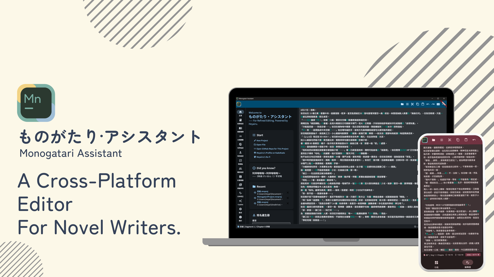
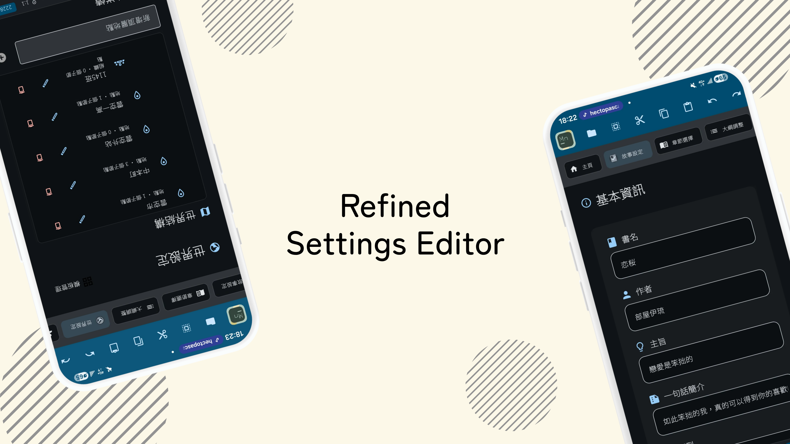
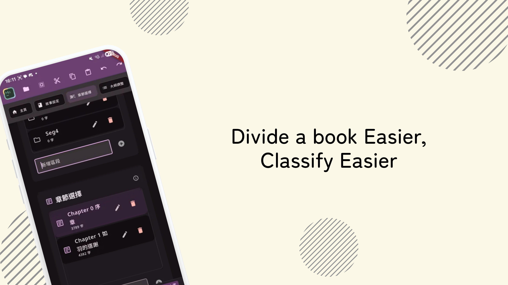
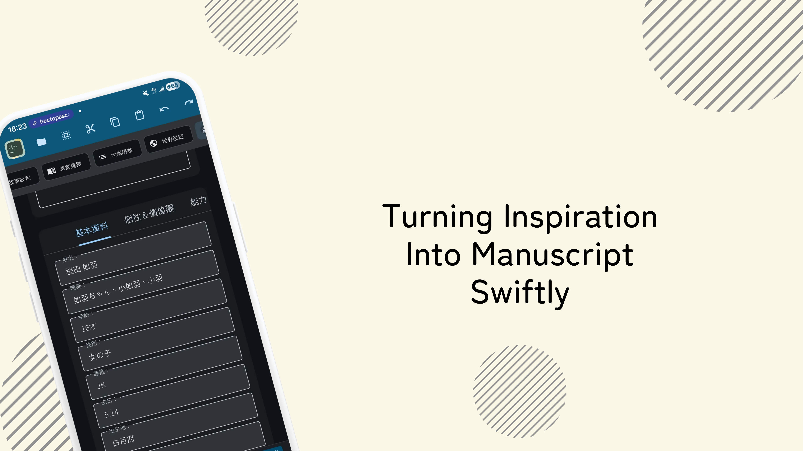
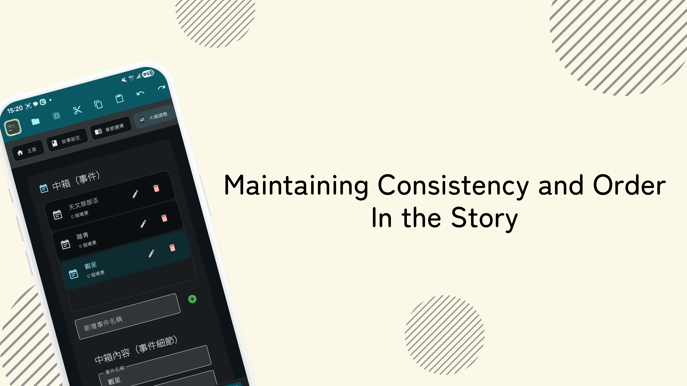
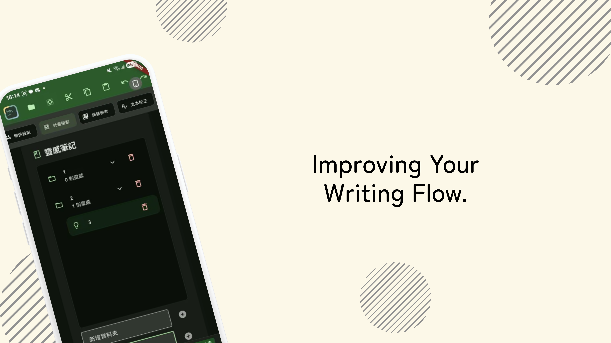
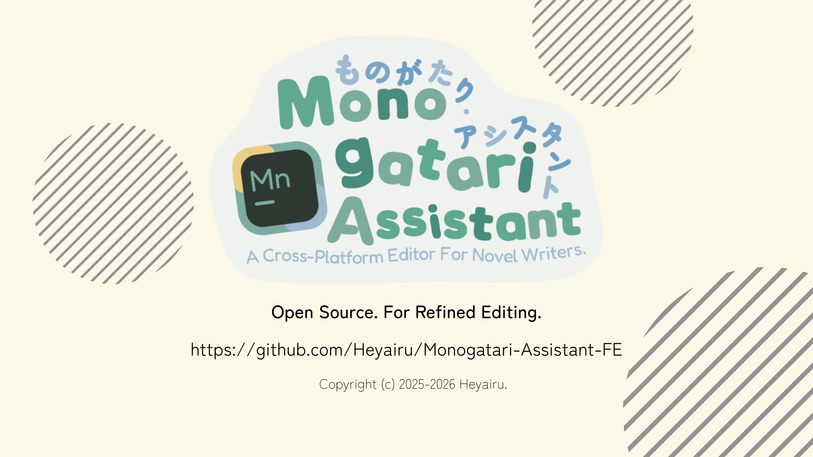

# Monogatari Assistant FE


> 一款專為故事創作者設計的跨平台寫作助手，協助整理章節、正文、角色、世界觀、大綱與校稿資料。

[](LICENSE.md)
[](https://dart.dev)
[](https://flutter.dev)
[](#支援平台與需求)

## 專案介紹

<details>
<summary><h2>App Preview</h2></summary>
<table>
<tr>
<td></td>
<td></td>
<td></td>
<td></td>
</tr>
<tr>
<td></td>
<td></td>
<td></td>
<td></td>
</tr>
</table>
</details>

「物語 Assistant」是一款面向小說家、輕小說作者與故事創作者的輕量級編輯工具。它把創作流程中的章節、角色、世界觀、大綱、術語與校稿資料集中在同一個工作區，讓創作者能在寫作時同步維護設定與結構，降低後期反覆修正的成本。

相較於一般文字編輯器，本工具更重視結構化資料與視覺化整理。你可以先建立故事骨架，再逐步補上角色、地點、事件、衝突點與補充設定；也可以從正文開始寫，再回頭整理設定資料。

## 功能總覽

| 模組 | 說明 |
| --- | --- |
| 故事設定 | 管理故事名稱、作者、類型、簡介與目標讀者等基本資訊。 |
| 章節與正文 | 以分部和章節組織稿件，支援拖曳排序、快速切換與章節內容同步。 |
| 大綱調整 | 建立故事線、事件、場景、衝突點與備註，適合規劃長篇故事結構。 |
| 世界設定 | 管理地點、歷史背景、文化特色與地理環境等世界觀資料。 |
| 角色設定 | 維護角色基本資料、外觀、性格、能力、社交特質與補充註記。 |
| 術語表 | 管理作品中的專有名詞、設定詞與用語資料，協助維持文字一致性。 |
| 企劃與校稿 | 提供企劃整理、校稿輔助與寫作檢查相關視圖。 |
| 搜尋與取代 | 支援正則表達式、大小寫敏感，以及全形半形不敏感搜尋。 |

## 基本使用流程

1. 建立或開啟故事專案。
2. 在「故事設定」填寫作品基本資料。
3. 到「章節選擇」建立分部與章節架構。
4. 在編輯器中撰寫正文，並依需要整理大綱、角色、世界觀與術語表。
5. 使用搜尋、取代與校稿相關功能檢查稿件一致性。

## 支援平台與需求

### Windows / macOS / Linux

| Items | Minimum Requirements | Recommended |
| --- | --- | --- |
| CPU | x64/Arm64, 1GHz up, Intel Celeron | i5-4570 equivalent & greater |
| RAM | 4 GiB up | 8 GiB up |
| Storage | 500 MiB Available | 1 GiB Available |
| System | Win10(1809) / macOS 10.14 / Ubuntu 20.04 | Win10(22H2)+ / macOS 14+ / Ubuntu 20.04+ |

### Android

| Items | Minimum Requirements | Recommended |
| --- | --- | --- |
| System | Android 5 (API Level 21) | Android 8+ |
| RAM | 4 GiB up | 6 GiB up |
| Storage | 200 MiB Available | 500 MiB Available |

### iOS

| Items | Minimum Requirements | Recommended |
| --- | --- | --- |
| System | iOS 12.0 | iOS 15+ |
| Device | iPhone 7 equivalent & greater | iPhone 11 equivalent & greater |
| Storage | 200 MiB Available | 500 MiB Available |

## 開發環境

主要 Flutter 專案位於 `dart_edition/`。

```powershell
cd dart_edition
flutter pub get
flutter run
```

常用檢查指令：

```powershell
flutter analyze
flutter test
```

如果修改了 Freezed 或 Riverpod annotation 相關檔案，請重新產生程式碼：

```powershell
dart run build_runner build --delete-conflicting-outputs
```

## 技術架構

| 類別 | 使用技術 |
| --- | --- |
| Framework | Flutter |
| Language | Dart `^3.9.2` |
| State Management | Riverpod / Riverpod Generator |
| Data Model | Freezed |
| Editor | Flutter Quill、Code Text Field |
| File / Data Format | XML、JSON assets |
| UI | Material Design 3 |

### 主要依賴

```yaml
dependencies:
  flutter_riverpod: ^2.6.1
  riverpod_annotation: ^2.6.1
  freezed_annotation: ^2.4.4
  file_picker: ^8.1.2
  path_provider: ^2.1.4
  intl: ^0.20.0
  uuid: ^4.5.0
  shared_preferences: ^2.3.3
  http: ^1.6.0
  window_manager: ^0.4.3
  xml: ^6.6.1
  flutter_quill: ^11.5.0
```

## 專案結構

```text
.
├── README.md
├── LICENSE.md
├── Title.png
├── AppPreview/
└── dart_edition/
    ├── lib/
    │   ├── main.dart
    │   ├── bin/                    # App shell、工具列、檔案與編輯器輔助
    │   ├── data/repositories/      # 資料存取與 repository
    │   ├── domain/usecases/        # 應用流程與專案檔案 use case
    │   ├── models/                 # Freezed data models
    │   ├── modules/                # 各功能頁面
    │   ├── presentation/providers/ # Riverpod providers
    │   └── utils/                  # 文字索引與 debounce 等工具
    ├── assets/                     # 圖示、字型與 JSON 資料
    ├── test/
    └── pubspec.yaml
```

## 授權與致謝

本專案採用 [Business Source License 1.1](LICENSE.md)。

Logo 靈感來源於 ProgrammingVTuberLogos / GitHub@Aikoyori。
