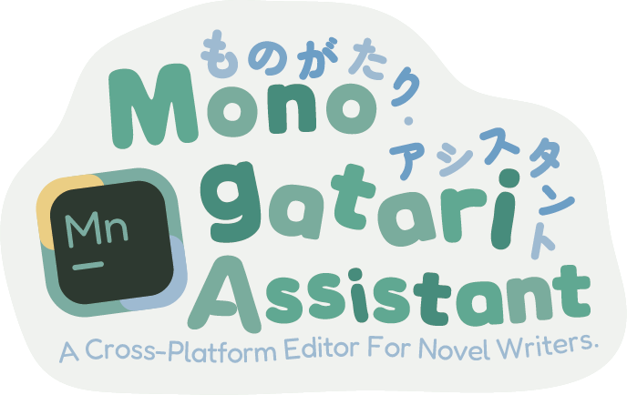
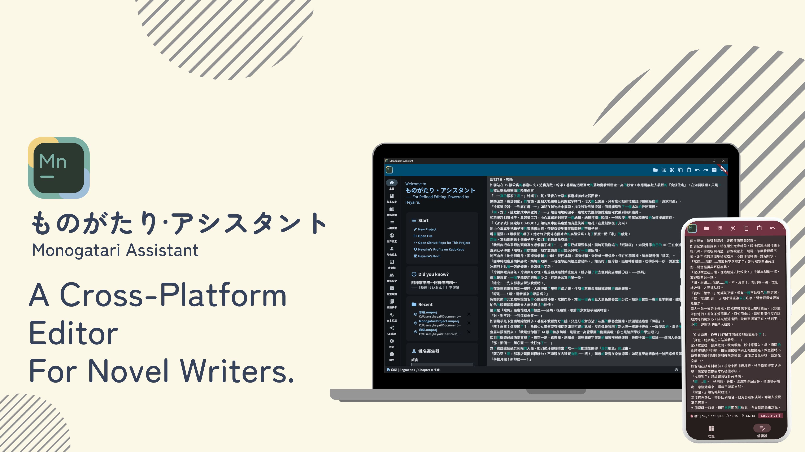
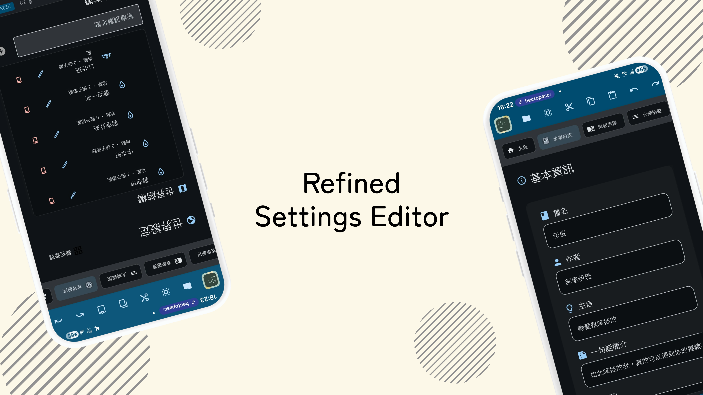
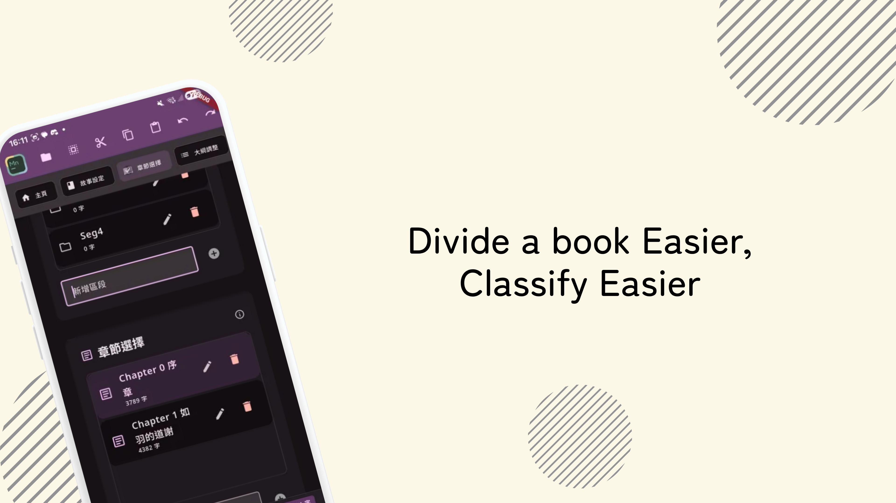
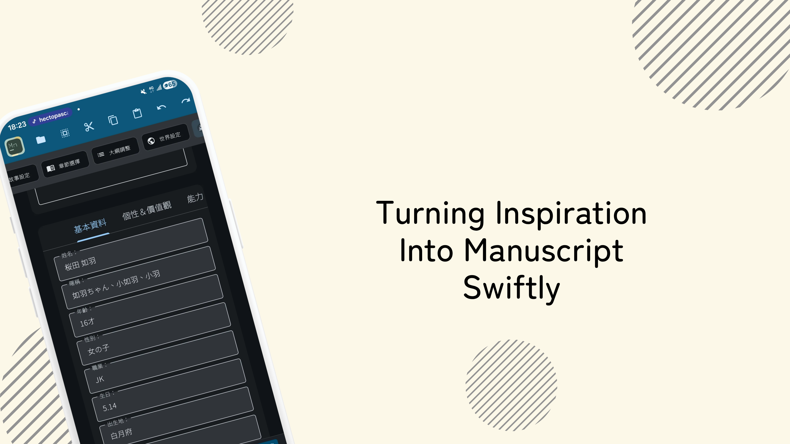
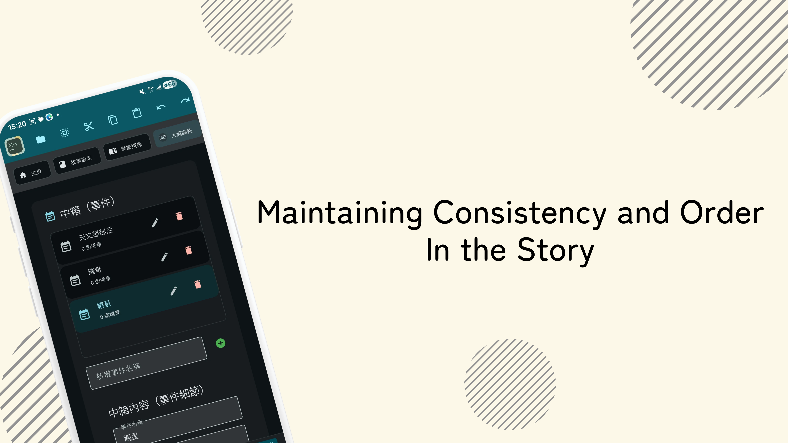
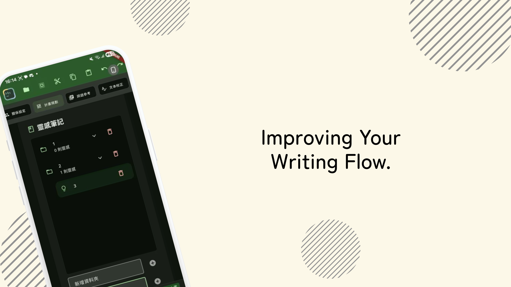
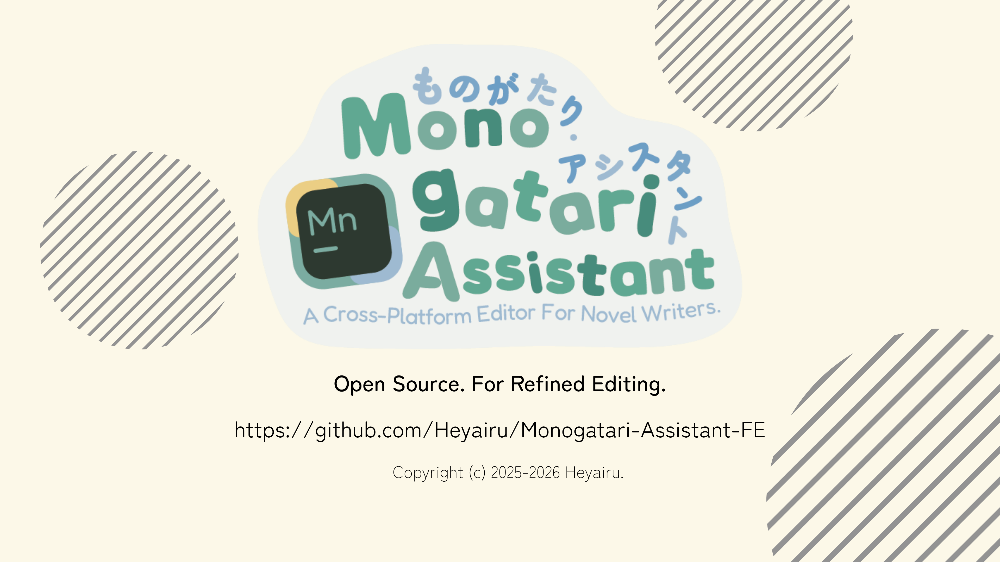

# Monogatari Assistant FE



> 一款為故事創作者設計的跨平台寫作助手，集中整理正文、章節、大綱、角色、世界觀、物品與時間軸。

[](LICENSE.md)
[](dart_edition/pubspec.yaml)
[](dart_edition/pubspec.yaml)

## 文件

| 文件 | 內容 |
| --- | --- |
| [統一說明文件](docs/GUIDE.md) | 功能、使用流程、保存與備份、開發環境、架構及發布 |
| [統一 API 文件](docs/API.md) | MCP、專案檔案、Rhodanthe、Copilot adapter、P2P 與協作介面 |
| [文件中心](docs/README.md) | 文件分工、版本依據與維護規範 |
| [參考文件索引](docs/SOURCES.md) | 保留的專題規格、使用指南、設計與發布驗收文件 |

## 畫面預覽

<details>
<summary><h2>App Preview</h2></summary>
<table>
<tr>
<td></td>
<td></td>
<td></td>
<td></td>
</tr>
<tr>
<td></td>
<td></td>
<td></td>
<td></td>
</tr>
</table>
</details>
## 功能概覽

- 章節與正文編輯、大綱、故事設定、角色與關係圖、世界觀及術語。
- 物品管理、Scene 狀態快照、主時間軸與微型時間軸。
- 搜尋與取代、正文標記、專案短語庫、校稿與修訂追蹤。
- 本機專案、匯入匯出、自動備份、內網 P2P 同步與即時協作。
- Copilot 與本機 MCP 唯讀整合；Ask／Plan 依 build 旗標開放，Plan 只提供提案與驗證。

目前 App 版本為 `0.9.31`，專案 XML 格式為 `1.18`。各功能的限制與平台驗收狀態見[說明文件](docs/GUIDE.md)。

## 快速啟動

主要 Flutter 專案位於 `dart_edition/`。目前要求 Dart `^3.12.0`；`pubspec.yaml` 的 Flutter Quill 相依註記要求 Flutter 3.44 以上。原生 Rhodanthe 另需 Rust／Cargo，工具鏈以 `dart_edition/rust/rust-toolchain.toml` 為準。

```powershell
cd dart_edition
flutter pub get
flutter run
```

常用檢查：

```powershell
flutter analyze
flutter test
```

修改 Freezed 或 Riverpod annotation 後：

```powershell
dart run build_runner build --delete-conflicting-outputs
```

更多格式、政策、Rust 與發布檢查見[開發與驗證說明](docs/GUIDE.md#10-驗證建置與發布)。

## 授權與致謝

原始碼採 [Apache License 2.0](LICENSE.md)，另見 [NOTICE](NOTICE.md) 與[商標說明](TRADEMARKS.md)。Monogatari Assistant™ 與其標誌是 Heyairu（部屋伊琉）的商標。

Logo 靈感來源於 ProgrammingVTuberLogos / GitHub@Aikoyori。
