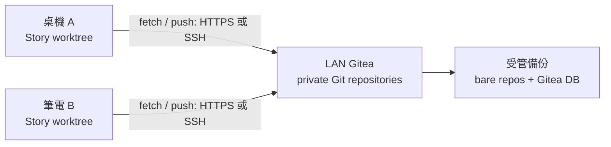
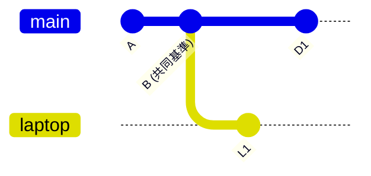
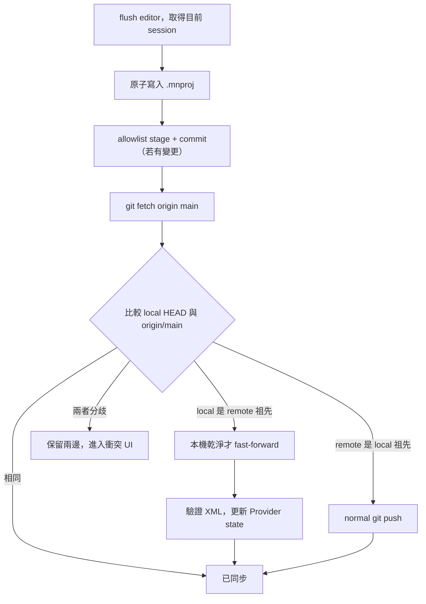

# 物語 Assistant：Git 為核心的內網同步設計

> 文件狀態：設計提案（尚未實作）  
> 適用情境：單一作者、多台桌面裝置；重視離線寫作、版本歷史與安全復原。  
> 相關文件：[一般內網同步設計](INTRANET_SYNC_DESIGN.md)

## 1. 結論

Git 很適合用來同步本專案的 `.mnproj`：它是可讀、可 diff 的 XML，且每台裝置都能在離線時保留完整歷史。推薦模式是「每部作品一個 Git repository、內網 Gitea 作 private remote、App 對 XML 的存檔後自動 commit，再以 fetch/push 同步」。

這是**版本控制同步**，不是即時共同編輯。Git 能明確偵測兩台裝置離線後各自修改造成的分歧，並保留兩份內容；它不能理解章節、角色與正文的語意，所以第一版不得自動合併衝突 XML，更不能 `push --force`。

第一版應明確限定為 Windows、macOS、Linux。桌面端可在受控條件下呼叫 Git CLI；Android/iOS 不應假設存在可執行的 `git`，日後需改用嵌入式 Git library 或 Git-aware gateway，才能參與同一套 repository 歷史。

## 2. 與目前專案的關係

| 目前事實 | Git 同步的設計含義 |
| --- | --- |
| App 原始碼 repository 已有 GitHub `origin` | 此 repository 只放 App 原始碼；絕不可把使用者小說 `git add` 到這裡。 |
| 故事是一個使用者任意選擇位置的 `.mnproj` XML | 每部故事要建立/clone 到獨立的 story repository root。 |
| XML 根節點已有 `<Project UUID="...">` | `projectUUID` 用於對照 App 的 Git 設定；不是 commit SHA。 |
| `FileService.saveProject*` 直接整份回寫檔案 | Git commit 必須在 App 已成功原子存檔之後才進行。 |
| `ProjectIoSessionCoordinator` 能取消舊專案 I/O 回寫 | Git 同步 coordinator 也要檢查同一個 project session，避免切換作品後舊 fetch 改寫目前畫面。 |
| `http` 只用於 Copilot | Git 同步與 Copilot 的 API key / client / 設定完全分離。 |

## 3. 推薦架構



Gitea 可部署在 NAS 或一台常開桌機。它提供 private repo、使用者權限、HTTPS/SSH token/key、Web revision 檢視和備份管理；若要求資料不離開內網，不應把 GitHub/GitLab 當故事的主要 remote。

remote 可使用 HTTPS + personal access token，或 SSH + 每裝置獨立 key。兩者都必須使用 TLS/SSH 的主機身分驗證；token/key 只存 OS credential store、SSH agent 或平台 secure storage，絕不寫進 `.mnproj`、remote URL、commit message 或 `shared_preferences`。

## 4. 每部作品的 repository 版面

```text
星海傳奇/                         # Git worktree root
├── 星海傳奇.mnproj                # 追蹤：作品主要 XML
├── README.md                      # 可選：作品介紹/協作規則
├── .gitattributes                 # 追蹤：正規化文字 diff
├── .gitignore                     # 追蹤：排除暫存資料
├── exports/                       # 可選：是否追蹤由使用者選擇
└── .monogatari/                   # 不追蹤：本機 App/Git metadata
    ├── sync-state.json
    └── conflict-copies/
```

`.gitattributes` 建議如下：

```gitattributes
*.mnproj text eol=lf diff=mnproj
*.md text eol=lf
*.txt text eol=lf
```

`.gitignore` 建議如下：

```gitignore
.monogatari/
autosave/
*.tmp
*.bak
```

不能將 `*.mnproj` 標成 binary，也不要設定 `merge=union`。前者失去可讀 diff；後者會把兩邊的 XML 節點盲目串接，造成重複章節或破壞排序。App 的 XML serializer 也應穩定輸出 UTF-8、LF、元素順序和縮排，避免一次小修改產生全檔 diff。

## 5. Git 基礎原理

```text
工作目錄（working tree） -- git add --> 暫存區（index） -- git commit --> 本機歷史（.git）
                                                                         |
                                                               git push / fetch
                                                                         v
                                                                  remote origin
```

| 名詞 | 意義 | 對故事同步的意思 |
| --- | --- | --- |
| working tree | 使用者目前看到的檔案 | App 寫入的 `故事.mnproj`。 |
| index | 下一個 commit 的檔案清單 | App 只 stage 明確 allowlist，禁止 `git add .`。 |
| commit | 指向父 commit 的不可變快照 | 一次成功儲存後建立的作品版本；由 SHA 識別。 |
| branch | 指向一段 commit 歷史的名稱 | MVP 使用 `main`；衝突時另建 branch。 |
| remote/origin | 遠端 repository 別名 | LAN Gitea 的專案 URL。 |
| fetch | 下載遠端 commit 資訊，不變更檔案 | 安全檢查另一台是否有新版本。 |
| push | 上傳本機獨有 commits | 只允許 fast-forward，禁止 force push。 |

Git 以 commit 的父子關係形成 DAG，而非檔案時間排序。若 A、B 都從共同 commit `B` 離線修改，各自 commit 後會有兩條分支：



`L1` 與 `D1` 都不是另一方祖先，這叫 divergence。它不是錯誤，而是要求使用者或專用 merge 工具決定的事。拿最後儲存時間覆蓋，或 `push --force`，都會無聲丟失其中一端內容。

## 6. 同步流程

### 6.1 同步前的本機 metadata 與狀態

每個 Git-backed project 在 `.monogatari/` 保存**不追蹤** metadata：

```json
{
  "projectUuid": "現有 Project UUID",
  "trackedProjectFile": "星海傳奇.mnproj",
  "remoteName": "origin",
  "branch": "main",
  "lastKnownHead": "f4b7...",
  "lastSuccessfulFetchAt": "2026-08-09T12:00:00Z"
}
```

UI 至少區分：未啟用、本機未提交、已提交待推送、同步中、已同步、遠端有更新、分歧需處理、認證失敗與離線。秘密資料不在此檔。

### 6.2 建立與開啟

1. 使用者選擇「建立內網 repository」或「clone 既有作品」。
2. App 在使用者選定的故事目錄 init/clone；不會對任意 `.mnproj` 的父目錄直接 `git init`，除非使用者確認搬移到新 worktree。
3. 驗證主檔唯一、XML 可解析、`Project UUID` 合法，再寫入 `.gitattributes` / `.gitignore`。
4. 匯入既有作品時，以明確 initial commit 加入主 `.mnproj`；建立 private remote 後第一次 push `main`。
5. 若「另存新檔」是新作品，重新產生 `projectUUID`、建立新 repo；若只是同作品分支，保留 UUID 並建立新 branch。這個選擇必須由 UI 顯示，不能猜測。

### 6.3 按下同步或自動同步的標準演算法



流程細節：

1. 先用既有 editor sync 將目前編輯器文字寫入 ProjectData；產生 immutable XML payload，再**原子**寫入 tracked 主檔。寫入失敗就停止。
2. 僅 stage 允許的相對路徑（主 `.mnproj`、`.md`、`.gitattributes`、`.gitignore`）；禁止 `git add .`。
3. index 無變更時不建立空 commit；有變更時以不含正文、token 或絕對路徑的固定格式 commit。
4. 執行 `fetch`，以 commit graph 做 ancestor 判斷；不能比較 mtime，也不使用一步完成且難以控制的 `git pull`。
5. local HEAD 與 `origin/main` 相同：完成。
6. local 是 remote 的祖先：代表本機無獨有版本。僅當 working tree clean、session 仍有效時才 fast-forward，之後驗證 XML UUID/format，再原子套用並重建 Riverpod state。
7. remote 是 local 的祖先：normal push。若 push 被拒絕（fetch 後 remote 又前進），重新 fetch 再判斷。
8. 其他情況一律視為 divergence；不自動 merge、rebase、reset 或 force push。

可在成功存檔後 5–10 秒 debounce、App 回到前景及手動按鈕時觸發同步。關閉 App 時只能盡力 push 已安全 commit 的資料，不可因等待網路阻塞關閉。所有 Git 動作要由每個專案一條 queue 序列化，async 回來時再核對 project session token。

### 6.4 收到遠端更新時

App focus/resume 或定期 fetch 後，若 remote 前進：本機乾淨才提示/fast-forward；本機正編輯、dirty 或未保存時，顯示「遠端有更新」，等待使用者完成本機存檔並觸發上述流程。不可在編輯途中直接替換 TextEditingController，也不可讓舊專案的 fetch 回應寫進目前開啟的專案。

## 7. 衝突與復原

對完整 `.mnproj`，第一版的準則是「先保兩份，再讓使用者選」。衝突 UI 應顯示 local/remote HEAD、共同祖先、來源裝置、時間、檔案大小、Project UUID、XML parse 結果和章節摘要，並提供 diff、匯出兩份檔案、採用遠端副本、保留本機為 conflict branch、稍後處理。

安全預設流程：

1. 不改寫現有 `main` worktree。
2. 建立 `conflict/<device-id>/<timestamp>` 指向 local HEAD。
3. 建立指向 `origin/main` 的另一個暫存工作副本，供 App 或外部 Git 工具比較。
4. 使用者決定後建立新的 resolved commit，再 normal push。
5. conflict branch 至少保留 30 天或直到使用者手動刪除。

如果使用者主動要求嘗試 Git merge，必須先備份，且發現 `<<<<<<<`、`=======`、`>>>>>>>` conflict marker 後，絕不可把該 XML 送入 parser 或覆寫使用者作品。日後才可建立 `.mnproj` 專用三方 merge：用 base/local/remote XML 轉成 ProjectData、依實體 UUID 合併欄位；正文同段變動仍需保留明確衝突。

## 8. 安全與 LAN 部署

- Gitea 只對內網介面提供 HTTPS/SSH；不做 router port forwarding。
- 固定 LAN DNS 名稱或 DHCP reservation，避免 remote URL 綁死會改變的 IP。
- 使用內部 CA 簽 TLS，讓所有裝置信任 CA；不能用 `http.sslVerify=false` 規避憑證錯誤。
- 防火牆只開預期 VLAN 到 HTTPS（與選用 SSH）port；訪客 Wi-Fi 不可連 Git server。
- 每台裝置用獨立 account/token/key，可單獨撤銷；每部作品是 private repository，`main` 禁止 force push。
- 備份 bare repositories、Gitea database/config、CA recovery material；Git revision 歷史不是單點伺服器故障時的備份替代品。

## 9. 建議程式架構

```text
presentation（同步按鈕、狀態、衝突 UI）
      ↓
GitSyncCoordinator（流程、session、排程）
      ↓
GitRepository（status、commit、fetch、graph、push 的抽象）
      ↓
GitCliRepository（桌面 MVP）/ GitGatewayRepository（未來手機）
```

| 建議位置 | 責任 |
| --- | --- |
| `lib/domain/repositories/git_repository.dart` | Git 動作的 typed interface，無 UI、無 shell。 |
| `lib/domain/models/git_sync_models.dart` | Repo 設定、ahead/behind/diverged、衝突與錯誤型別。 |
| `lib/application/services/git_sync_coordinator.dart` | 串接 XML snapshot、本機 I/O、Git graph、session check 與狀態機。 |
| `lib/data/repositories/git_cli_repository.dart` | 桌面受控 Git CLI adapter。 |
| `lib/data/repositories/git_gateway_repository.dart` | 未來 Android/iOS 呼叫 Git-aware LAN service 的 adapter。 |
| `lib/presentation/providers/git_sync_providers.dart` | Riverpod state 與使用者動作。 |

`FileRepository` 繼續處理檔案/XML；`GitRepository` 只處理 Git；只有 coordinator 可同時協調兩者。同步不能在 widget build、每次 TextEditingController listener 或 Copilot 模組中直接執行。

桌面 CLI adapter 的規則：只在 Windows/macOS/Linux 啟用，先驗證 `git --version` 與 worktree；以 `Process.run('git', ['-C', repoRoot, ...])` 傳遞 argument list，不能透過 PowerShell/cmd 或字串拼接 shell command；需處理 exit code、stderr、timeout、取消與 repo-root/path allowlist。禁止 `reset --hard`、`clean -fd`、`push --force`、全域 Git config 與刪除 branch。

## 10. 行動平台與 Git-aware gateway

| 平台 | 直接 Git CLI | 推薦方向 |
| --- | --- | --- |
| Windows/macOS/Linux | 可行 | 受控 CLI，採 OS Git Credential Manager 或 SSH agent。 |
| Android | 不可靠 | embedded Git library 或 gateway；保留本機 `.mnproj` 與 outbox。 |
| iOS | 不可假設 | gateway 或包裝原生 Git library，處理 sandbox/background 限制。 |
| Web | 不可行 | 用 gateway/API 重新實作工作副本語意。 |

Git-aware gateway 是 HTTP 服務，但它的權威儲存仍是 Git repository：手機以 HTTPS 上傳已驗證快照，gateway 代表裝置建立 Git commit / fetch / push / diff。這不是把作品改存成自訂資料庫，而是把不能執行 Git CLI 的平台接到同一條 Git 歷史；gateway 仍需 ACL、認證、重試與內容驗證。

## 11. 測試、分期與驗收

| 測試情境 | 驗收結果 |
| --- | --- |
| A 修改、commit、push；B fetch | B 僅在乾淨狀態 fast-forward，解析內容等同 A commit。 |
| 離線多次儲存 | 有多個 local commit；重連後可安全 push。 |
| A、B 同時離線修改 | 偵測 divergence，兩份內容與兩條歷史皆保留。 |
| remote 在 fetch 後又前進 | push 被拒後轉入重新 fetch/分歧流程。 |
| XML 出現 conflict marker | 拒絕解析與覆寫，顯示 resolver。 |
| autosave/tmp/.monogatari 存在 | allowlist 不會將它們 commit。 |
| 切換專案時舊 fetch 完成 | session check 阻止舊結果影響目前 project/UI。 |
| token 過期、DNS/TLS 失敗 | 顯示操作性錯誤，本機檔案與 commits 完整保留。 |

| Phase | 內容 | 完成條件 |
| --- | --- | --- |
| 0 | Gitea 測試部署、TLS/SSH、private test repo | 兩台裝置可安全 clone/push，無明文 HTTP。 |
| 1 | Desktop GitRepository fake + CLI adapter、repo init/clone/status | 不會觸碰 App 原始碼 repo，且能顯示工作區狀態。 |
| 2 | coordinator、原子寫入、commit/fetch/fast-forward/push | 兩台桌面可 sequential sync，斷網不丟變更。 |
| 3 | divergence UI、歷史、匯出與 conflict branch | 同時離線編輯時能安全復原兩端內容。 |
| 4 | Android/iOS gateway 或 embedded Git spike | 依成本與安全性決定是否承諾行動平台 Git sync。 |
| 5 | XML 語意 merge / 多人 PR 協作 | 僅在 fixtures 與復原工具成熟後進行。 |

## 12. 需要確認的產品決策

1. 第一版是否接受桌面優先，手機同步列為後續？
2. Gitea 由誰維運：NAS、常開桌機，還是團隊 server？誰負責備份？
3. 是單一作者多裝置，還是多人協作？後者應用 protected `main` + branch/PR，不能背景自動推送同一分支。
4. 使用者是否允許在 App 外以 VS Code、SourceTree 或 Gitea Web 操作？若允許，App 在 focus/resume 時必須先 fetch/status。
5. 另存新檔預設是「新作品」還是「同作品分支」？這決定 project UUID 與 repository 的生命週期。

最小下一步是先在 LAN 建立 Gitea 測試 repo，為桌面寫 `GitRepository` fake 與 commit graph（equal/ahead/behind/diverged）測試；先驗證不丟資料與衝突保留，再連接 UI 和真實 Git CLI。
