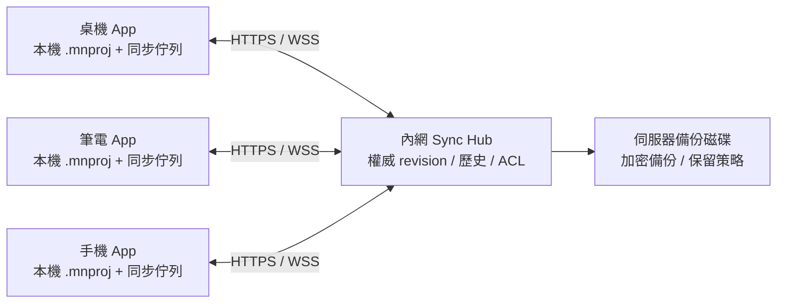
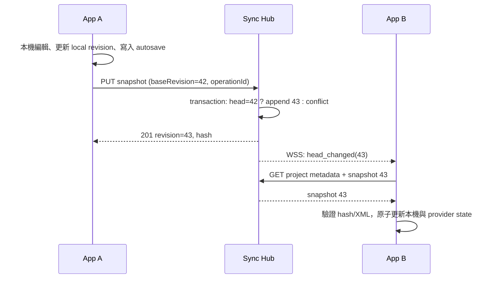

# 物語 Assistant：內網同步設計與網路原理

> 文件狀態：設計提案（尚未實作）  
> 範圍：在同一個家庭、工作室或公司內網中，讓多台物語 Assistant 裝置同步同一份 `.mnproj` 專案；不以公開雲端或多人逐字共同編輯為第一階段目標。

> 若選擇以 Git 作為版本與同步層，請以 [GIT_BASED_SYNC_DESIGN.md](GIT_BASED_SYNC_DESIGN.md) 為主。本文的 Sync Hub 架構仍可作為 Git 後端的包裝服務參考，但不再是唯一建議。

> 若選擇裝置彼此直連、沒有常駐伺服器的模式，請參考 [P2P_LAN_SYNC_DESIGN.md](P2P_LAN_SYNC_DESIGN.md)。

## 1. 結論與建議

建議採用 **local-first 用戶端 + 內網同步中樞（Sync Hub）** 的架構：每台裝置仍可完全離線讀寫本機 `.mnproj`，連上內網後才把「已驗證的專案快照」上傳到中樞，並透過 WebSocket 收到其他裝置的更新通知。

這比「把 `.mnproj` 直接放在 SMB/NAS 共用資料夾，讓每台 App 都打開同一個檔案」安全。現行檔案格式是一個完整 XML，儲存時直接把全檔內容寫回原路徑；兩台裝置同時存檔時，後存的一方會覆蓋另一方，網路磁碟也無法替 App 做語意合併。

第一版應做 **單一作者、多裝置的版本快照同步**，可離線、可復原、遇到衝突不遺失資料。等這條路徑穩定且有確實的多人同編需求，再把「章節正文」升級為 CRDT/OT 型即時協作；不要一開始就為所有設定資料導入複雜的即時合併演算法。

## 2. 專案現況盤點

| 面向 | 現況 | 對同步設計的影響 |
| --- | --- | --- |
| App | Flutter / Dart，支援 Windows、macOS、Linux、Android、iOS | 同步核心應放在 Dart 的 domain/data 層；不可讓 UI 或平台檔案 API 直接處理協定。 |
| 應用狀態 | Riverpod providers；`main.dart` 維護 `_projectDataRevision` | 可將每次本機變動後的 revision 作為「排程同步是否已過期」的判斷，不可當跨裝置版本號。 |
| 專案格式 | 一個 `.mnproj` XML；根節點已有穩定的 `<Project UUID="...">` | `projectUUID` 可作為同步專案 ID，不必由檔案路徑或名稱猜測。 |
| 存取層 | `FileRepository` → `ProjectFileUseCase` → `FileService` | 新增 `SyncRepository`，維持檔案存取與網路存取分離。 |
| 本機儲存 | `FileService.saveProject*` 直接寫入原路徑；自動儲存與備份已有流程 | 同步不能取代本機存檔及備份；只應取得已序列化的不可變 payload。 |
| 排程與防競態 | `ProjectIoSessionCoordinator` 會序列化本機 I/O，並使已切換專案的 callback 失效 | 同步佇列應沿用相同 session token / revision 概念，避免舊專案的回應覆寫目前畫面。 |
| 現有網路 | `http` 僅由 `modules/copliot.dart` 呼叫外部 AI API，且有逾時與大小限制 | 同步客戶端須是獨立服務，不能重用 Copilot 設定、API key 或請求流程。 |

目前沒有專案同步、同步版本、遠端帳號或網路檔案監聽的程式碼。文件內的「同步」不是既有 `main.dart` 中把 TextEditingController 寫回章節的 editor sync；後者僅是**同一台裝置內的 UI 狀態同步**。

## 3. 目標、非目標與前提

### 目標

- 同一使用者可在桌機、筆電、手機之間同步同一個專案。
- 斷網時可繼續創作；重新連線後自動檢查並安全同步。
- 任一衝突都可保留雙方內容與共同歷史，不能默默採用最後寫入者。
- 不必把專案內容上傳到公網；中樞可部署於 NAS、家用伺服器或一台常開桌機。
- 使用者可清楚看見連線、同步中、離線、衝突、上次成功時間及錯誤原因。

### 第一階段非目標

- 兩人同時在同一段文字逐字編輯、游標即時顯示與毫秒級合併。
- 跨 Internet 的帳號系統、OAuth、公開分享連結。
- 直接支援 SMB、Dropbox、Syncthing 等外部檔案同步器作為多人寫入協定。
- 將 Copilot 的 AI 對話或 API key 同步到其他裝置。

### 規模假設

設計基準為每個 Sync Hub 約 1–10 位使用者、每專案 1–5 台裝置、一般文字專案（單一 XML 遠小於 20 MiB）。若有大量附件，應把附件列為後續獨立 blob 同步，不要塞進 XML 或 WebSocket 訊息。

## 4. 為何選擇「中樞」而不是點對點或共用資料夾

| 方案 | 優點 | 主要問題 | 結論 |
| --- | --- | --- | --- |
| 共用資料夾（SMB/NAS） | 最少後端程式 | 無語意版本控制、鎖定跨平台不一致、離線差、直接覆寫整個 XML | 僅可作手動備份位置，不做同步協定。 |
| 裝置對裝置 P2P | 不需常駐伺服器 | 裝置發現、睡眠、NAT/VLAN、衝突仲裁與每台資料保留都很複雜 | 不建議第一版。 |
| Sync Hub（推薦） | 單一權威 revision、所有裝置可離線、可做 ACL/歷史/備份 | 須部署一個小型服務 | 最符合目前單檔 XML 與多平台 App。 |



Sync Hub 是「同步的協調者與版本帳本」，不是讓 App 用網路路徑開檔的磁碟機。各 App 仍持有自己的本機工作副本；因此手機睡眠、Wi-Fi 切換或中樞短暫停機不會阻止寫作。

## 5. 資料與版本模型

### 5.1 三種識別碼不可混用

| 欄位 | 來源與生命週期 | 用途 |
| --- | --- | --- |
| `projectId` | 直接使用現有 `ProjectData.projectUUID` | Sync Hub 上的專案主鍵；匯入既有專案時第一次啟用同步即註冊。 |
| `deviceId` | 安裝 App 時產生 UUID，保留在本機安全儲存區 | 顯示來源裝置、去重與衝突副本命名；不是使用者身分。 |
| `serverRevision` | Sync Hub 對每個 project 單調遞增的整數 | 跨裝置比較與 optimistic concurrency 的唯一依據。 |

`_projectDataRevision` 是本機記憶體的變動計數，切換專案或重新開 App 都會重設；它只可用於取消過時的背景工作，絕不能傳到伺服器當版本號。

### 5.2 用戶端同步中繼資料

不要把同步密碼、token 或伺服器 URL 寫進 `.mnproj`。建議在 App 的 application-support 目錄，以 `projectUUID` 為 key 保存下列本機資料（或使用加密資料庫）：

```json
{
  "projectId": "1b4a...",
  "hubId": "a8cf...",
  "lastPulledRevision": 42,
  "lastAcknowledgedHash": "sha256:...",
  "syncEnabled": true,
  "lastSuccessfulSyncAt": "2026-08-09T12:00:00Z"
}
```

認證 refresh token、裝置私鑰或配對憑證必須放在 iOS Keychain、Android Keystore、Windows Credential Manager 等平台安全儲存，而非 `shared_preferences`。一般同步偏好（是否自動同步、選定 Hub）可放設定 repository，但秘密資料不可放入其中。

### 5.3 快照封包

第一版的可傳輸單位是**完整且已驗證的 XML 快照**。每次上傳都帶明確 metadata；Hub 以內容雜湊驗證傳輸完整性並保存不可變 revision。

```json
{
  "projectId": "1b4a...",
  "baseRevision": 42,
  "clientOperationId": "0f6d...",
  "deviceId": "74c2...",
  "formatVersion": "<現有 .mnproj ver>",
  "contentEncoding": "gzip",
  "contentSha256": "…",
  "content": "<二進位 payload>"
}
```

- `clientOperationId` 必須在重試時保持不變，Hub 以 `(deviceId, clientOperationId)` 去重，避免逾時後重送造成兩個 revision。
- hash 是傳輸與儲存損壞偵測，不是取代 TLS 的安全機制。
- Hub 解壓前必須限制壓縮後大小與解壓後大小，並限制 XML 層級及請求 body，避免壓縮炸彈或資源耗盡。
- 每份快照先以現有 XML parser 驗證版本與 `Project UUID` 是否等於 URL 中的 `projectId`，才可進入歷史。

### 5.4 伺服器最低資料表

| 資料 | 關鍵欄位 | 說明 |
| --- | --- | --- |
| `hubs` / `users` / `devices` | hub、使用者與裝置 ID | 每台已配對裝置可撤銷。 |
| `projects` | `project_id`, `head_revision`, owner | 專案最新 revision 的比較與交換（CAS）點。 |
| `project_revisions` | project ID、revision、hash、blob path、author device、created at | append-only 歷史與衝突復原來源。 |
| `project_members` | project ID、使用者/裝置、role | `owner`、`editor`、`viewer` 的授權資料。 |
| `idempotency_keys` | device ID、operation ID、結果 revision | 安全重試。 |

資料庫可用 SQLite（單機 Hub、小規模）或 PostgreSQL（多使用者與營運需求）；快照 blob 可先落在 Hub 的受管資料目錄。關鍵要求不是資料庫種類，而是「建立 revision 與更新 `head_revision` 必須在同一交易中比較 base revision」。

## 6. 同步協定

### 6.1 傳輸分工

| 通道 | 用途 | 原因 |
| --- | --- | --- |
| HTTPS REST | 配對、登入、專案清單、抓取快照、上傳快照、歷史與衝突操作 | 有明確 request/response、容易重試、便於 proxy 與審計。 |
| WSS（WebSocket over TLS） | 只推送「某專案 head 已改變」的小事件與連線狀態 | 免除高頻輪詢，但實際資料仍走可驗證、可重試的 HTTPS。 |
| mDNS / DNS-SD（可選） | 區網自動找到 Hub | 降低輸入 IP 的摩擦；不能是唯一連線方式。 |

不要把完整專案或長時間編輯操作直接當成 WebSocket 訊息。WebSocket 斷線很正常；它只負責通知，客戶端收到事件後重新用 REST 讀取最新 revision，才能處理遺失、重複或亂序的通知。

### 6.2 REST API 草案

所有 `/v1/*` 都必須驗證身分並以 HTTPS 提供；省略的 response 都至少包含 `requestId` 以利除錯。

| Method / path | 說明 | 成功結果 |
| --- | --- | --- |
| `GET /healthz` | 健康檢查，不含私密資料 | 200、版本、時間 |
| `POST /v1/pairing/claim` | 用 QR/短碼建立裝置憑證 | access token、refresh token、hub ID |
| `GET /v1/projects` | 可存取專案及其 head revision | 專案 metadata 陣列 |
| `GET /v1/projects/{id}` | 取得 head metadata | revision、hash、format version |
| `GET /v1/projects/{id}/revisions/{n}/snapshot` | 下載指定完整快照 | gzip bytes、ETag/hash |
| `PUT /v1/projects/{id}/snapshot` | 以 `baseRevision` 上傳下一個快照 | 201、新 revision、hash |
| `GET /v1/projects/{id}/revisions` | 供歷史與復原 UI 使用 | revision 清單、來源裝置、時間 |
| `POST /v1/projects/{id}/conflict-copies` | 將保留的本機內容建立獨立衝突副本 | 新 project/revision 參考 |

上傳也可把 `baseRevision` 放在 `If-Match: "rev-42"`，而封包 body 保存必要資訊。當伺服器 head 已不是 42 時，回傳 `409 Conflict` 與最新 head metadata，**絕不改寫 head**。未授權為 `401/403`，過大為 `413`，已見過相同 operation 為 `200/201`（冪等回應）。

### 6.3 WebSocket 事件草案

```json
{
  "type": "project.head_changed",
  "eventId": "…",
  "projectId": "1b4a…",
  "revision": 43,
  "contentSha256": "…",
  "changedByDeviceId": "74c2…",
  "occurredAt": "2026-08-09T12:00:00Z"
}
```

客戶端只在 `revision > lastPulledRevision` 時排入 pull。`eventId` 可用於診斷和去重，但正確性依賴 revision 比較；重連後仍要對開啟中的專案做 `GET /projects/{id}` 的 reconciliation。

### 6.4 標準同步流程



### 6.5 客戶端狀態機

| 狀態 | 可轉移條件 | 行為 |
| --- | --- | --- |
| `offline` | 網路不可達或 Hub 未設定 | 正常本機編輯；保留最後已確認 server revision。 |
| `idle` | 無本機變更且已與 head 一致 | 顯示「已同步」。 |
| `uploadQueued` | 本機資料變更、停筆 debounce 後 | 將不可變 payload 放進持久化 outbox。 |
| `uploading` | 有連線且 queue 有工作 | 以當時 base revision 上傳；不要持有可變 provider reference。 |
| `downloading` | 收到較新 head，且本機乾淨 | 下載、驗證、套用並寫本機檔。 |
| `conflict` | 遠端較新且本機 dirty，或 upload 回 409 | 停止自動覆寫，要求使用者選擇或建立衝突副本。 |
| `error` | 認證、格式、儲存或不可恢復錯誤 | 保留原檔與 queue，顯示可操作的錯誤。 |

建議 upload debounce 為停止編輯後 5–10 秒，另加最長延遲（例如 60 秒）及手動「立即同步」。不應將每一次鍵入都上傳完整 XML。App 進 background、切換專案與關閉時可以嘗試 flush，但不得以未完成網路請求阻塞關閉；outbox 必須可在下次啟動恢復。

## 7. 衝突策略：先保資料，再談自動合併

### 7.1 何時可自動套用遠端

- 本機沒有未上傳修改，且 remote revision 大於 `lastPulledRevision`：自動下載並套用。
- 本機最後確認 hash 與遠端 hash 相同：視為已同步，即使通知重複也不做事。
- 同一個 `clientOperationId` 的重試：採用 Hub 回傳的既有成功結果。

### 7.2 何時必須進入衝突 UI

- 本機有未上傳內容，同時收到較新 remote revision。
- 上傳時 `baseRevision` 不符（409）。
- 下載資料的 XML、UUID、格式版本或 hash 驗證失敗。

衝突畫面至少提供：本機修改時間/字數/來源裝置、遠端 revision/來源裝置/時間、預覽、`保留本機為衝突副本`、`採用遠端`、`匯出兩份檔案`。預設按鈕應是「保留兩者」，不能預設 `last write wins`。

第一版不嘗試把兩個完整 XML 做通用三方自動 merge：章節順序、角色關係、時間線與正文互相引用，字串層 merge 很容易產生結構可解析但語意錯誤的專案。第二階段可依資料種類增量改善：

| 資料類型 | 後續合併方向 |
| --- | --- |
| 角色、地點、企劃項目 | 以既有 UUID 為 key 的欄位層級三方 merge；同欄位才衝突。 |
| 章節排序、時間線 | 帶 stable item ID 的操作日誌與明確排序規則。 |
| 章節正文 | 每章獨立文件，採 CRDT（例如 Yjs-compatible 模型）或 OT；需要 cursor、tombstone、compaction 與權限設計。 |

## 8. 安全與內網部署

「在內網」不等於可信任。訪客 Wi-Fi、被感染的電腦、錯誤 VLAN 設定，以及任何能連上 Wi-Fi 的裝置，都是威脅來源。

### 必要控制

- **TLS 全程加密：** REST 使用 HTTPS、通知使用 WSS；禁止 HTTP 明文傳遞專案或 token。自簽 CA 可以，但需透過 QR 配對把 CA fingerprint/Hub public key 固定（pin），不要略過憑證驗證。
- **配對而非共用密碼：** Hub 顯示一次性、短時效 pairing code；新裝置掃 QR 或輸碼後取得可撤銷的 device credential。QR 內容包含 `https` endpoint、hub ID、憑證指紋與一次性 code，不含長期 token。
- **最小權限：** 專案 ACL 至少 owner/editor/viewer；下載、上傳、歷史與刪除都各自授權。
- **輸入防護：** server 驗證 content type、壓縮與解壓大小、XML 專案版本、UUID 一致性、請求頻率；記錄 request ID、裝置 ID、結果，勿記錄正文或 token。
- **備份與復原：** Hub 的資料磁碟應加密備份；revision 保留至少最近 100 版或 30 天，並可由 owner 手動釘選版本。
- **撤銷：** 設定頁可列出已配對裝置並撤銷；Hub 立即拒絕該 token、關閉其 WSS 連線，且可選擇輪替專案金鑰。

### 網路分段與防火牆

Hub 應有固定 DHCP reservation 或內網 DNS 名稱（例如 `monogatari-sync.home.arpa`），服務只聆聽 LAN 介面，不做路由器 port forwarding。防火牆僅開放 TCP 443 給預期 VLAN；mDNS 使用 UDP 5353，若公司 Wi-Fi 隔離 multicast，就改用手動輸入 HTTPS URL 或 QR 配對。不要因為 discovery 失敗而改成廣播傳資料。

建議以反向 proxy（例如 Caddy 或 Nginx）終結 TLS，再反代到不對外暴露的 Sync Hub process；資料庫與 blob 目錄不得直接對 LAN 分享。部署前檢查 UPS/備份、磁碟權限與服務自動重啟。

## 9. 網路基礎原理，對照本專案

### 9.1 分層：資料如何由 App 到另一台裝置

```text
ProjectData / XML 快照
        ↓
HTTPS REST 或 WSS 訊息（應用層）
        ↓
TLS：加密、伺服器身分驗證、完整性（安全層）
        ↓
TCP：可靠、有順序的位元流（傳輸層）
        ↓
IP：在子網 / 路由器間找到目的位址（網路層）
        ↓
Wi-Fi / Ethernet：區域網路實體傳送（鏈路層）
```

每層解決不同問題。`http` 套件處理的是最上層的 HTTP；它不會自動發現伺服器、信任自簽憑證、解決 Wi-Fi 斷線、或合併兩份 XML。因此同步模組要明確處理 discovery、認證、retry、版本與衝突。

### 9.2 IP、子網、DNS、port 與 mDNS

- **IP 位址**像網路上的住址。`192.168.1.23` 與 `192.168.1.50` 通常在相同私有子網，可透過交換器直接傳送；不同 VLAN/子網則需要路由器和防火牆規則。
- **DNS**把名稱轉成 IP，例如 `monogatari-sync.home.arpa → 192.168.1.23`。固定名稱比把 IP 寫進 App 穩定，因為 DHCP 可能改變 IP。
- **port**是同一台機器中服務的門牌號。HTTPS 慣用 TCP 443；URL `https://host:443` 的 host 找到主機、port 找到服務。
- **mDNS/DNS-SD**是沒有集中 DNS 時的區網名稱/服務發現。Hub 可宣告 `_monogatari-sync._tcp.local`，App 顯示可配對的服務；但 multicast 常被企業網路封鎖，因此 QR/手動 URL 是必要備援。

### 9.3 TCP 為何仍會失敗

TCP 會重送遺失封包、維持位元順序，因此適合專案快照；但它只保證「已連上的兩端間的 bytes」，不保證使用者認為的操作成功。若 App 把 snapshot 送出後網路中斷，Hub 可能已建立 revision、也可能尚未收到。這就是 `clientOperationId` 冪等鍵的用途：重試同一操作時，Hub 回覆既有結果，而非再建立一版。

TCP 也不保證兩個裝置的事件順序與真實世界相同。手機從睡眠恢復後可能先收到舊 WebSocket 通知；因此以單調遞增的 `serverRevision` 判斷新舊，不能依裝置時鐘或收到通知的時間判斷。

### 9.4 HTTP、REST 與 WebSocket 的分工

HTTP 是「一個 request 對一個 response」：很適合 `PUT snapshot` 後得到「成功建立 revision 43」或「409 conflict」。REST 是在 HTTP 上為資源取清楚 URL 與 method 的慣例，不是額外的網路協定。

WebSocket 由 HTTP 握手升級為雙向長連線，適合 Hub 主動說「另一台裝置已更新」。它不等同可靠的同步資料庫：手機休眠、proxy timeout、Wi-Fi roam 都會斷線。因此本方案用它做通知，以 HTTP 的版本查詢與下載補正真實狀態。

### 9.5 TLS 與憑證

TLS 使旁人不能讀取或竄改 XML，並讓 App 能確認它連的是預期 Hub。只用「內網 IP + token」仍可能遭 ARP/DNS 欺騙或封包側錄。自簽憑證本身不是不安全；危險的是 App 無條件接受任何自簽憑證。配對時 pin Hub 的 public-key/certificate fingerprint 才能建立可信的第一次連線。

### 9.6 延遲、頻寬、逾時與退避

- **延遲（latency）**是一次往返所需時間；它影響使用者按下同步到收到結果的感受。
- **頻寬（bandwidth）**是每秒可傳的量；完整 XML 快照對普通 LAN 很小，但每鍵一次上傳仍會浪費電力與造成版本噪音。
- **timeout** 避免卡住的網路請求無限佔用資源。現有 Copilot HTTP 實作已有 timeout/response-size 的防護精神；同步服務亦應設定連線、讀取與整體 deadline。
- **exponential backoff + jitter** 表示失敗後等待約 1、2、4、8 秒並加入隨機小偏移，而不是所有離線裝置同時猛連 Hub。遇到 `401/403/409/413` 這類明確錯誤不可盲目重試，必須走對應 UI。

## 10. 與現有 Flutter 程式的實作切點

以下為建議檔案邊界；名稱可調整，但依賴方向要維持 `presentation → application/domain → data`。

```text
lib/
  domain/
    models/sync_models.dart                 # Hub、revision、outbox、衝突資料型別
    repositories/sync_repository.dart       # 網路同步抽象介面
  data/
    repositories/http_sync_repository.dart  # REST/WSS、DTO、驗證與 retry
    local/sync_metadata_store.dart           # 非機密同步 metadata/outbox
    local/secure_credential_store.dart       # 平台安全憑證封裝
  application/
    services/project_sync_coordinator.dart  # session/revision、push/pull/衝突狀態機
  presentation/providers/
    sync_providers.dart                     # Hub 設定、同步狀態與 UI actions
  presentation/widgets/
    sync_status_indicator.dart
    sync_conflict_dialog.dart
```

| 現有位置 | 應保留的責任 | 新同步接法 |
| --- | --- | --- |
| `lib/models/project_data.dart` | 現有 `projectUUID` 與領域資料 | 將 `projectUUID` 傳作 `projectId`；不加入 token。 |
| `lib/presentation/providers/project_io_providers.dart` | 從 provider snapshot 產生 XML `ProjectIoPayload` | 新增不帶副作用的 `prepareSyncPayload`，由 Sync Coordinator 呼叫。 |
| `lib/services/project_io_session_coordinator.dart` | 本機 I/O 的 session 失效與序列化 | Sync Coordinator 使用相同 token / current check；不要直接共用私有 queue。 |
| `lib/main.dart` | 編輯器 flush、自動儲存、切換專案 | 本機儲存成功後通知 coordinator；接收遠端更新時先判斷 dirty，再由 provider 層套用。 |
| `lib/data/repositories/settings_repository.dart` | 非秘密的偏好設定 | 保存同步開關與已選 Hub ID；不保存 access token。 |
| `lib/modules/copliot.dart` | AI HTTP | 不改動、不共用 client；同步需自己的 base URL、認證與 lifecycle。 |
| `lib/bin/file.dart` | 本機讀寫及 XML parse/generate | 補一個原子寫入 helper，下載驗證後再安全覆寫本機 project。 |

同步不能在 widget 的 `build()`、TextEditingController listener 或每次 provider rebuild 中直接發 HTTP。正確邊界是：資料變更 → 更新 local revision → debounce → coordinator 擷取 immutable snapshot → 持久化 outbox → 背景網路工作 → 回寫顯式 sync state。

### 10.1 本機寫檔的原子性

現行 `_FileIO.write` 直接 `writeAsString`。同步導入後更需要避免中途斷電或網路拉取後使專案檔截斷。桌面平台建議：

1. 在**相同目錄、相同檔案系統**寫入暫存檔（`<name>.tmp`），UTF-8、flush。
2. 重新讀取/驗證 hash 與 XML。
3. 將舊檔保留為短暫 `.bak`，以 rename/replace 原子替換目標。
4. 成功後再更新 recent-project metadata 與 `lastPulledRevision`。

Android SAF URI 未必提供 rename 語意，需採「寫入前保留本機 autosave / versioned copy、成功寫入後才提交 metadata」的降級流程。任何寫入失敗都不得把「已套用 remote」標記為成功。

### 10.2 平台權限與套件評估

- Android 需要 `INTERNET`；若做 mDNS，還需 NSD 相關實作與測試。切勿為方便而開啟全域 cleartext HTTP。
- iOS 要加入 Local Network privacy usage description；使用 Bonjour/mDNS 時列出服務型別。實機首次連線會顯示本機網路權限提示。
- Windows/macOS/Linux 的 App 本身只做 outbound client，通常不需打開入站防火牆；Hub 才需開 TCP 443。若未來讓 App 充當 Hub，會大幅增加防火牆、背景存活與平台限制。
- `http` 可保留作 REST；WebSocket 另採可測試、支援目標平台的 client abstraction。安全儲存與 mDNS 都以介面包裝，避免直接滲入 UI。

## 11. 交付階段與驗收標準

| Phase | 內容 | 驗收條件 |
| --- | --- | --- |
| 0：決策與 spike | 決定 Hub 部署主機、TLS/CA、QR 配對、資料留存；建立假 Hub 合約測試 | 兩台測試裝置可安全配對且能驗證 Hub 身分。 |
| 1：本機基礎 | Sync models、metadata、secure credential、持久化 outbox、原子寫檔、同步狀態 UI | 斷網重啟後 queue 仍存在；任何失敗不遺失本機檔。 |
| 2：快照同步 | REST snapshot upload/download、server revision、hash、冪等重試、手動同步 | 同一專案在兩台裝置的 sequential edits 可在不衝突下互相可見。 |
| 3：通知與自動化 | WSS 通知、reconnect reconciliation、debounce、前/背景策略 | App B 收到 App A 更新後自動 pull；斷線重連不漏更新。 |
| 4：衝突與歷史 | 409 flow、衝突副本、revision history、復原、裝置撤銷 | 兩端同時離線修改後，兩份內容都能被使用者復原與開啟。 |
| 5：多人協作（選做） | entity-level merge、每章 CRDT/OT、presence | 只有在 Phase 4 穩定且需求成立時開始。 |

必做測試：正常 upload/pull、重複 request、回應在 server commit 後遺失、切換專案時舊回應到達、Wi-Fi 切換、Hub 重啟、超大/損壞 gzip、錯 UUID、過期 token、撤銷裝置、遠端更新時本機 dirty、手機 background/restore、Android SAF 寫入失敗，以及多平台 migration 後格式版本不相容。

建議的可觀測欄位為 request ID、project UUID（必要時雜湊）、revision、operation ID、裝置 ID 雜湊、耗時、HTTP status、retry reason；日誌不可包含正文、完整 XML、access token 或 pairing code。

## 12. 在開始實作前要確認的產品決策

1. 主要情境是否是「同一位作者的多裝置」還是「多位作者共編」？本文件的 MVP 針對前者。
2. Hub 是否可由 NAS/Docker/常開桌機承載？若不能，需重新評估 P2P 或選定現有同步服務。
3. 內網是否有 guest Wi-Fi、VLAN 或公司 IT 規範？這會影響 mDNS 與防火牆，但不改變 HTTPS/WSS 的必要性。
4. 專案內容是否含敏感稿件？若是，須明訂 Hub 備份加密、管理者可否讀取資料、撤銷與保留期限。
5. 是否需要同步附件（圖片、參考資料）？若需要，應獨立設計 content-addressed blob 與配額，而非延伸本期 XML 快照。

確認以上決策後，最小可行的第一個工程任務是：建立 `SyncRepository` 介面、snapshot API contract 與 fake Hub 的整合測試，再接入 App 的 immutable `ProjectIoPayload`。這能先驗證版本與衝突模型，不會過早綁死正式後端技術。
