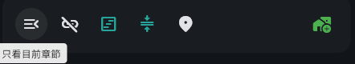

# NeonUI：平面圖示工具列設計規範

## 1. 設計方向與視覺基準

NeonUI 採用使用者提供的兩張工具列截圖作為視覺基準：深色表面、簡潔的 Material 圖示、清楚的明暗層級，以及少量直接套在圖示本體上的綠色／藍綠色。按鈕平時背景透明，滑鼠移入才出現低對比圓形底色。




本版取代原先以電梯按鈕、IH 爐與機箱指示燈推導的外觀規則。**一般圖示與按鈕不繪製裝飾性亮環、斷環、LED 點、局部狀態弧、光暈或霓虹陰影。狀態色直接作用於圖示。** NeonUI 名稱保留，但不據此增加發光效果。

截圖中的外觀重點：

- 第一張：共用圓角深色工具列；第一個圖示有深灰圓形 hover 底色與 tooltip；部分圖示呈藍綠色，右端新增操作呈綠色，其餘可用操作呈淺灰。
- 第二張：緊湊的水平圖示列；暗灰與淺灰圖示並列，右端圖示呈綠色；圖示外沒有環、燈點或常駐圓形底座。
- 圖片可確認外觀，不能單憑顏色判定某個按鈕的實際開關值或禁用條件；狀態仍由既有 controller／provider 決定。

首批套用範圍為關係設定、時間軸及共用快照預覽工具列。關係線、時間軸節點及資料格式沿用各自的規則；元件樣式由 NeonUI 自身管理。

## 2. 尺寸、排列與表面

尺寸沿用 [元件尺寸規範](COMPONENT_SIZE_GUIDELINES.md)，固定內距沿用 [Padding 規範](PADDING_GUIDELINES.md)。截圖為視覺參考，像素尺寸不直接等同 Flutter dp；以下為本專案的實作值。

| 項目 | 規格 |
| --- | --- |
| 桌面圖示按鈕 | 最小 40 × 40 dp 互動區；使用 `AppControlSize.height`，不因狀態而改變尺寸。 |
| 圖示 | 一般 24 dp，密集清單操作 20 dp；同一工具列採一致尺寸。 |
| 按鈕內距 | 24 dp 圖示配四側 8 dp；不額外預留外環或 LED 空間。 |
| Hover／pressed 底色 | 40 dp 圓形狀態層，置中於按鈕；平時透明。 |
| 相鄰按鈕 | 40 dp 互動區可相接，圖示筆畫之間自然保留空間；需要分組時增加 8 或 16 dp 間距。 |
| 工具列容器 | 可沿用既有面板表面；獨立工具列建議水平 8、垂直 4 dp 內距及 16 dp 圓角。同組按鈕共用一個表面。 |
| 末端操作 | 如參考圖的新增按鈕，可用彈性空間與前段操作分隔；不使用固定大段空白模擬位置。 |
| 觸控模式 | 命中區至少 48 × 48 dp；由配置提供互不重疊的空間，保留圖示尺寸。 |
| 窄版與縮放 | 空間不足時換行或採既有收合機制；不縮小圖示、互動區或裁切 tooltip。 |

Material 的預設 padded 命中區不可讓桌面列意外膨脹成每顆 48 dp。桌面使用明確的 40 dp constraints 與 `shrinkWrap`，觸控配置再明確擴大互動區。

## 3. 配色與狀態語意

### 3.1 參考圖色票

以下深色色值取自使用者截圖中的主要實色像素。它們是參考圖的基準；正式元件從 `NeonUiTheme` 取得對應角色，頁面不直接指定 hex。淺色與高對比主題另配可讀色票，尺寸與互動規則一致。

| 色彩角色 | 深色參考值 | 用途 |
| --- | --- | --- |
| 工具列表面 | `#191C20` | 同一組按鈕共用的背景。 |
| 外層深色表面 | `#111418` | 工具列外的背景參考，不強制覆寫頁面底色。 |
| Hover 底色 | `#292C2F` | 中性圓形狀態層。 |
| 一般可用圖示 | `#E1E2E8` | 搜尋、縮放、定位、重新整理及其他一般操作；未啟用但可切換的 toggle 也使用此色。 |
| 禁用圖示 | `#65676C` | 不可操作的圖示；對應第二張圖的暗灰層級。 |
| 藍綠重點 | `#26A69A` | 時間軸篩選／整理功能的啟用色，以及連結相關狀態。 |
| 綠色重點 | `#4CAF50` | 關係圖 toggle 的啟用色，以及已指定採綠色的新增操作。 |

綠色與藍綠色都可以表示 toggle 已啟用，由工具列的功能分組決定；同一組 toggle 使用同一色系。藍綠色不再只限於「連線就緒」。圖示的可用性、功能重點及資料狀態是不同來源，不能只靠顏色推測。

### 3.2 元件狀態

| 情境 | 圖示本體 | 背景與其他呈現 |
| --- | --- | --- |
| 一般可用操作 | 淺灰 | 透明背景。 |
| Toggle 關閉但可操作 | 淺灰 | 透明背景；tooltip／語意說明「未啟用」。 |
| Toggle 已啟用 | 該組指定的綠色或藍綠色 | 透明背景；tooltip／語意說明「已啟用」。 |
| 功能重點操作 | 明確指定的綠色或藍綠色 | 透明背景；例如參考圖的綠色新增按鈕。顏色不代表它有持續開啟的狀態。 |
| Hover | 保持原有圖示色 | 顯示低對比深灰圓形底色及既有 tooltip。 |
| Pressed | 保持原有圖示色 | 中性底色稍加強，保留 Material ripple。 |
| Keyboard focus | 保持原有圖示色 | 使用可辨識的中性 focus 狀態層；必要時顯示高對比 focus 外框，失焦即移除。 |
| Disabled | 暗灰 | 停止 hover、pressed 與 ripple；tooltip 說明不可用原因。 |
| Busy | 以同尺寸進度圖示暫代功能圖示 | 阻止重複觸發，tooltip／語意說明「處理中」；不在原圖示外加旋轉弧。 |

一次性操作完成後回到既定的功能色，不新增「完成常亮」效果。Hover 底色也不能當作 `selected` 底色；已啟用的按鈕離開 hover 後仍只有彩色圖示。

### 3.3 資料狀態與色彩解析

保留 `NeonStatus` 的語意，但由圖示本體與文字表達，不使用常駐 LED 或狀態環。

| 狀態 | 色彩角色 | 說明 |
| --- | --- | --- |
| `idle` | 一般可用圖示色 | 沒有額外資料狀態；不等於 disabled。 |
| `active` | 綠色 | 功能持續運作；toggle 本身的開關值由 `selected` 表達。 |
| `connected` | 藍綠色 | 關聯／連線就緒；tooltip 明確說明。 |
| `info` | 藍色 | 有明確的資訊或定位狀態才使用；一般定位命令預設仍為淺灰。 |
| `preview` | 紫色 | 歷史／快照預覽；搭配現有唯讀提示及 Tick。 |
| `notice` | 黃色 | 待確認或待補資訊。 |
| `warning` | 橙色 | 已發生且可恢復的異常。 |
| `error` | 紅色 | 錯誤或阻斷。 |

藍／紫／黃／橙／紅沿用語意角色，實際色值由各主題配色與對比檢查決定；參考截圖未展示這些情境，不以截圖推導其色值。

前景色解析順序：

1. `onPressed == null`：使用禁用色；資料警告在鄰近文字或獨立狀態 Icon 保留。
2. `busy`：使用進度圖示，保留原資料狀態的語意文字；不因阻止回呼而套用普通 disabled 灰色。
3. 有非 `idle` 的資料狀態：使用對應狀態色。
4. 可執行的 `destructive` 操作：使用紅色圖示；tooltip 描述動作，不宣稱系統錯誤。
5. `selected == true`：使用該組 `selectedAccent`。
6. 其他可用操作：使用指定的 `accent`；預設為中性淺灰。

呼叫端若需合併多個資料狀態，採 `error > warning > notice > preview > connected > active > info > idle` 選取主狀態。這只處理資料狀態，不覆寫開關值或可用性。例如「已啟用且有警告」以橙色圖示提示警告，tooltip 與螢幕閱讀器同時讀出「已啟用，異常需要處理」。若兩種資訊必須同時可見，在旁邊補文字或獨立狀態 Icon。

## 4. 元件模型與目標 API

### 4.1 `NeonStatusIcon`

唯讀元件，用於清單、標題、狀態列及預覽提示。以指定尺寸顯示單一圖示，資料狀態直接決定圖示色；不包圓形底座或裝飾環。沒有資料狀態時沿用一般 Icon 的前景色。

狀態須有可讀文字或語意名稱。圖示與顏色不足以讓人辨識的情境，保留鄰近的狀態文字，例如「歷史預覽唯讀」。

### 4.2 `NeonIconButton`

以 Material `IconButton` 保留滑鼠、鍵盤、ripple、focus、tooltip 與 toggle semantics。以下為**修訂後的目標 API 草案**，不表示目前程式碼已支援所有參數：

```dart
enum NeonAccent { neutral, green, teal }

NeonIconButton({
  required IconData icon,
  required String label,
  required VoidCallback? onPressed,
  bool? selected,
  NeonAccent accent = NeonAccent.neutral,
  NeonAccent selectedAccent = NeonAccent.green,
  NeonStatus status = NeonStatus.idle,
  bool busy = false,
  bool destructive = false,
  String? statusLabel,
});
```

- `selected == null` 表示一次性操作；`false`／`true` 表示 toggle 關閉／開啟。開關值由既有資料來源重建。
- `accent` 是一般操作的功能色；綠色新增操作可明確指定，不需要假造 `selected` 或 `status: active`。
- `selectedAccent` 是 toggle 啟用色；時間軸使用 `teal`，關係圖使用 `green`。未啟用時回到 `accent`，一般 toggle 保持預設中性色。
- `status` 表達資料或系統狀態；`busy` 表達處理中；`destructive` 表達動作性質；`onPressed == null` 表達不可操作。
- `label` 必填，提供 tooltip 與語意名稱；`statusLabel` 補充資料狀態或禁用原因，避免重複朗讀同一標籤。

既有 `NeonIndicatorStyle` 的 `ring`／`dot` 不再用於此工具列設計。整理共用元件時應移除相關裝飾繪製與呼叫端依賴；若遷移期間仍保留相容 API，其預設必須為 `none`，且不得由 `selected` 或非 `idle` 狀態自動切回 `ring`。

## 5. 首批畫面對照

| 畫面 | 控制 | 狀態來源 | 目標外觀 |
| --- | --- | --- | --- |
| 關係設定 | 只顯示一階鄰居 | `_controller.neighborsOnly`、`selectedNodeId` | 開啟為綠色圖示，關閉且可用為淺灰；未選角色時暗灰禁用，tooltip 說明「先選擇角色」。 |
| 關係設定 | 合併相同雙向關係 | `_controller.mergeOpposite` | 開啟為綠色圖示，關閉為淺灰。 |
| 關係設定 | 搜尋／全局預覽／縮放／重新整理 | 現有回呼與可用條件 | 可用為淺灰，禁用為暗灰；hover 顯示中性圓形底色。 |
| 關係設定 | 快照檢視提示 | `selectedSnapshotEvent` | 紫色狀態圖示；保留唯讀文字與 Tick，新增關係在快照模式不可用。 |
| 時間軸 | 只看目前章節、未連結章節、略過空白 | `TimelineViewState` 對應布林值 | 開啟為藍綠色圖示，關閉為淺灰，禁用為暗灰。 |
| 時間軸 | 自動排序大綱 | `grid.autoSortOutline` | 開啟為藍綠色圖示；tooltip 明示同步變更大綱順序。 |
| 時間軸 | 返回目前 Tick | `currentTick` 與視窗位置 | 淺灰定位命令，hover 顯示中性圓形底色；不因圖示為定位符號自動配藍色。 |
| 時間軸 | 新增大／中／小箱 | `nextLevel` | 可用為綠色圖示，對照第一張圖的末端新增操作；無下一層時暗灰禁用，tooltip 說明小箱為末層。 |
| 共用快照預覽 | 跟隨／篩選 toggle 與導航命令 | 既有預覽狀態 | Toggle 依所在工具列指定綠／藍綠啟用色；導航命令淺灰，預覽狀態另以紫色圖示與文字提示。 |

警告、提醒、錯誤與連結狀態只在有可靠的資料來源時接入。例如開啟「未連結章節」篩選不代表資料出錯，不自動轉成橙色警告。

## 6. 互動、動畫與無障礙

- Hover、pressed 與色彩切換使用短暫淡入淡出，建議 120–180 ms；不脈衝、不閃燈、不使用 blur／glow。
- 減少動畫模式停用過渡與進度旋轉，改用靜態進度圖示與「處理中」語意。
- Tooltip 保留既有文案，可用開關附上「已啟用／未啟用」，禁用項目附上原因。外層 Tooltip 需支援讀取禁用說明。
- Tab focus 清楚可見，Enter／Space 可操作；一般 hover 不顯示 focus 外框。Focus 外框只作為鍵盤操作提示。
- 顏色之外，以 toggle semantics、tooltip、鄰近文字與必要的狀態圖示提供資訊；不要聲稱八種狀態能由同一圖示的顏色獨立辨識。
- 必要圖示與文字對比目標分別為 3:1、4.5:1；色票需對照實際表面檢查。截圖色值不是已通過所有對比檢查的主題色票。
- 淺色主題使用深色中性圖示與可讀的綠／藍綠色；高對比模式加強圖示、文字與 focus 層的對比，維持平面外觀。

## 7. 實作狀態與後續擴充

地點、角色、角色圖與物品頁面已接上新版共用元件，包含圖示工具列、快照操作、清單編輯／刪除，以及新增輸入框的圖示按鈕。

- `NeonUiTheme` 提供表面、hover、pressed、可用／禁用及功能色角色，包含明／暗／高對比配色。
- `NeonStatusIcon` 只繪製圖示本體或同尺寸進度圖示；已移除環、LED、啟用底座與陰影。
- `NeonIconButton` 支援 `accent`、`selectedAccent` 與 `iconSize`；Windows／Linux／macOS 使用至少 40 dp 互動區，其他平台使用至少 48 dp。
- `ItemActionBar` 與 `AddItemInput` 透過 `useNeonStyle: true` 套用相同樣式；上述頁面已啟用此設定。
- 共用快照預覽的導航、縮放、模式切換與編輯操作使用新版按鈕，保留既有狀態來源與快照唯讀限制。

主時間軸頁面的工具列尚待後續接入。擴充其他畫面時依第 5 節選擇色彩角色，並檢查 callback、tooltip、鍵盤、禁用條件與不同輸入方式下的尺寸。

## 8. 驗收條件

- 一般、已啟用、資料狀態與禁用圖示周圍都沒有裝飾亮環、斷環、LED 點或光暈；busy 只在圖示原位置顯示進度。
- 同列的一般操作為淺灰，禁用為暗灰；時間軸已啟用 toggle 為藍綠色，關係圖已啟用 toggle 為綠色，新增操作可依對照表呈綠色。
- Hover 出現中性圓形底色與 tooltip，移開即消失；selected 不留下常駐圓形底色。鍵盤 focus 有獨立且可辨識的提示。
- 桌面 40 dp 互動區與 20／24 dp 圖示排列一致；觸控命中區至少 48 dp，互不重疊；狀態切換不改變按鈕尺寸。
- Disabled 不觸發回呼，busy 阻止重複觸發；禁用原因、開關值、資料狀態與處理中語意均可讀取。
- 關係設定與時間軸既有切換、Tick 導航、快照唯讀限制及 `ValueKey` 保持有效，重建 widget 後仍由原資料來源決定狀態。
- 視覺比對涵蓋淺色／深色／高對比、hover／pressed／focus／selected／disabled／busy，以及 100%／200% 縮放；以本版附圖及規則作為基準。
