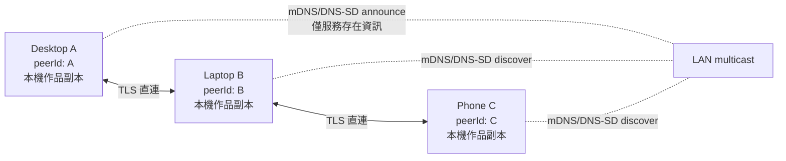
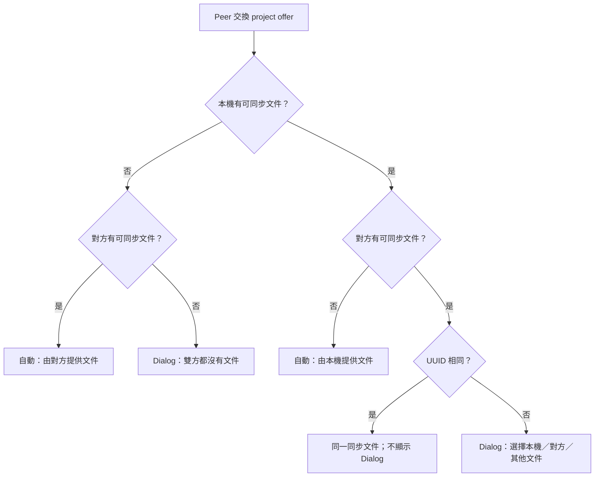

# 物語 Assistant：內網 P2P 同步設計

> 文件狀態：已進入實作；端點探測、即時檔案協商、session lifecycle、裝置身分配對、加密 revision summary／snapshot manifest、新裝置 bootstrap 共識規劃、production encrypted chunk／ACK gateway（含同 TCP 批次交換）、本機 immutable snapshot store，以及可跨 App 重啟續傳的 quarantine coordinator 完成  
> 適用情境：同一作者的 2–5 台裝置在同一個可信任 LAN 內同步作品，不想維運 NAS、Gitea 或常駐 Sync Hub。  
> 相關方案：[Git 模式](GIT_BASED_SYNC_DESIGN.md)、[中樞模式](INTRANET_SYNC_DESIGN.md)

> 已確認方向：採用本文件的 P2P 方案。目前已實作 WelcomeView 端點 UI、同步前置檢查、相容性探測、簽章配對確認、signed ephemeral X25519 authenticated encrypted transport、加密 revision summary／snapshot manifest 交換、新裝置 bootstrap 共識規劃、production encrypted chunk／ACK gateway、immutable outbound snapshot store、本機 quarantine 接收／續傳協調，以及欄位級三方合併／衝突 Dialog 基礎。網路 chunk 已可在 authenticated project session 中傳輸；驗證後 snapshot 尚未接到目前 ProjectData／使用者檔案，因此不會自動覆寫作品。

### 目前實作邊界

- 已實作：RFC1918 IPv4 / Port 驗證、本機 listener 開啟／中斷、本機 IP 顯示、peer 中斷、帶大小與逾時上限的產品相容性 probe、reachability state、存檔/dirty/UUID preflight 模型。
- 已實作：手動直連後以 bounded project offer 交換「是否有已儲存文件、檔名、UUID」，單方有檔時自動指定來源；只有雙方皆無檔或 UUID 不同才顯示文件選擇 Dialog。
- 已實作：發起端在 App 前景每 500ms refresh project offer；雙方無檔時任一方開啟可同步文件，兩端立即重判並關閉 Dialog。`ContentView` 全域監聽目前檔案與 UUID，不依賴 WelcomeView 是否顯示。
- 已實作：自動協商完成後鎖定 session project UUID；任一方改開不同 UUID／關閉來源文件時交換 bounded disconnect notice 並中斷 peer。相同 UUID 的一般 dirty 狀態只暫停內容同步，不誤判為換檔。
- 已實作：每台安裝產生 Ed25519 裝置身分；private seed 與 trusted peer allowlist 存入平台安全儲存區。配對使用十分鐘有效的 32-byte nonce challenge、Ed25519 簽章與雙端相同的六位數人工比較碼；challenge 剩餘一分鐘時自動輪替，並容許兩台裝置最多五分鐘的時鐘偏差。遭竄改的 challenge 或已信任 device ID 的 public key 改變時拒絕；上一輪過期封包只被忽略，不再令整個 session 進入錯誤。
- 已實作：`允許單端確認配對碼` 預設開啟且可於設定關閉。能力位元包含在 signed challenge 中；只有兩台裝置都宣告開啟時，任一端人工確認後，另一端才會驗證同一 transcript 的簽章、加入 allowlist 並自動回簽。任一端關閉時自動退回雙端各自確認。
- 已實作：每輪 signed challenge 綁定一把短期 X25519 public key；雙端 confirmation 與 allowlist 驗證通過後，以 X25519 shared secret + HKDF-SHA256 導出方向分離的 session keys，再以 ChaCha20-Poly1305、AAD、單調 sequence number 與 request ID 保護訊息。session key 只存在記憶體，重新配對／斷線／換檔／停止服務時銷毀。
- 已實作：revision summary 僅能在上述 authenticated encrypted transport 內交換；未安裝 session、session ID／sender 不符、密文竄改、重放 sequence、request ID 不符或 project UUID 不同時都拒絕。wire frame 有 64 KiB 上限，明文 payload 另限 40 KiB；沒有明文 fallback。
- 已實作：每次成功保存 revision 時建立 metadata-only snapshot manifest，內容只有 project/revision/hash、UTF-8 byte length、format version，以及固定 24 KiB chunk 規格。雙方目前 head 的 manifest 會隨 encrypted revision summary request/response 雙向交換，因此 Android → Windows 不能反向建連時仍可在同一成功方向取得；歷史 revision 另有 encrypted manifest request。manifest 必須與 summary head 完全相符，且沒有 XML、檔案路徑或 chunk bytes。
- 已實作：transport-agnostic 新裝置 bootstrap 共識規劃器。輸入必須包含加入裝置 ID、完整原始 trusted peer roster，以及每台 peer 經 authenticated session 取得的 summary／manifest observation。只有加入裝置尚未在 roster、原始 peer 至少兩台、每台皆可驗證、皆只有一個 head，且完整 revision metadata 與 manifest 完全一致時才產生 `ready`；來源依 device ID 決定性選擇。缺少／離線／manifest 不可驗證回覆為 `sourceUnavailable`，多 head 或任何 metadata 分歧為 `conflict`，不採多數決。規劃器採 sealed decision、roster 上限 64，且不含網路、下載、UI 或檔案寫入。
- 已實作：bounded snapshot chunk domain model 與本機 quarantine session。chunk 可亂序抵達與相同內容重送；不同內容的重複 index、大小／manifest 不符、缺塊、SHA-256 不符、非嚴格 UTF-8、DOCTYPE、Project UUID 或 format version 不符都不會產生可套用結果。每個 transfer 在 app-private support directory 保存嚴格 manifest metadata；每個已提交 chunk 另有 index、長度、SHA-256 與本機 commit time receipt，App 重啟只恢復 chunk／receipt 同時存在且 hash 相符的項目。預設最多保留 7 天、4 個 partial transfers 與 128 MiB chunk payload；開啟目標 transfer 前會預留完整 manifest 容量，並依最近活動時間淘汰舊資料。明確取消、永久失敗、格式驗證失敗或成功產生 immutable 記憶體結果時會刪除隔離檔案；單純 provider／App dispose 則保留合規 partial transfer 供下次續傳，且不會寫入目前專案。
- 已實作：每個已保存 revision 的 XML bytes 會先驗證 manifest SHA-256／長度並原子寫入 app-private immutable snapshot store，再提交 manifest 與 revision graph。相同 revision 可冪等重寫相同內容；既有檔案若遭竄改則拒絕覆寫，也不會宣告為可提供 snapshot。
- 已實作：transport-agnostic download coordinator 依 chunk index 順序請求、對暫時性錯誤做最多三次 bounded retry，同一生命週期或重新建立 coordinator 後都只要求缺少 chunk；永久性協定錯誤、格式錯誤與使用者取消會清空 quarantine，飛行中的晚到回應不會寫入。生產 Riverpod 已綁定 session-aware gateway；gateway 只接受 notifier 在 authenticated project session 建立後發出的 capability，並在回應前後檢查 generation、endpoint 與 project UUID。
- 已實作：production authenticated endpoint adapter 與 encrypted `snapshotChunkRequest`／`snapshotChunkResponse`。request 綁定完整 manifest 與 chunk index；response ACK 綁定 project UUID、revision ID、content SHA-256 與 index，且 clear payload／nested model 都拒絕額外欄位。只有 secure session、雙端顯式 content gate、app-private immutable content loader 與完全一致的本機 manifest 同時成立才回傳 chunk；換 session、換檔、取消配對、peer 斷線、停止服務或 provider dispose 會同時撤銷 capability 並關閉 gate，晚到回應會丟棄。每條 TCP 採 lockstep request/response，最多交換 32 個固定 24 KiB chunk，line reader 會保留 newline 後已讀入的 bytes；Android 原生 `Network.bindSocket()` 也在同一條 Wi-Fi-bound socket 完成整批，避免逐 chunk 重連造成頻繁 timeout。跨 batch 視窗預設從 8 個 chunk 開始，連續兩個完整成功批次後倍增至上限 32；TCP 已建立後的 response timeout／socket failure 會將視窗減半至下限 1，connect 階段失敗則保留視窗，避免把不可達誤判為接收端壓力。loopback 測試已涵蓋 wire → coordinator → quarantine → XML 驗證。
- 已實作：成功手動儲存、另存新檔或自動儲存後，以實際寫入的 XML bytes 建立 content SHA-256、不可變 revision metadata、version vector 與本機 revision DAG，並持久化到專案 UUID 專屬 metadata key。相同內容重複儲存不建立重複 revision；一般儲存不會把多個 concurrent heads 隱式視為已解決。
- 已實作：Map/Table 不同 key 聯集、同 key 逐欄三方比較、群組預設與欄位覆寫的衝突 Dialog 元件與單元/widget 測試。
- 尚未實作：自適應視窗的真機 telemetry／參數調校、實際 ProjectData adapter、遠端原子套用、bootstrap roster 蒐集／provider 與 `joiningReplica` UI 接線／下載套用，以及以正式外部安全審查或 pinned mutual TLS／成熟 Noise 實作取代或核准目前的 application-layer handshake。
- 安全限制：project offer 與 pairing frame 仍是 bounded pre-auth 訊息；offer 會交換檔名與 UUID，但不傳 revision hash、XML 或正文。revision summary、snapshot manifest 與 chunk 已進入 authenticated encrypted transport；chunk 只落入 quarantine，不直接寫使用者文件。這個 handshake composition 使用成熟 primitives，但仍未完成獨立外部安全審查；正式發佈前應完成審查或替換傳輸層。

## 1. 結論與取捨

P2P（peer-to-peer）可讓每台物語 Assistant 同時是同步的用戶端與小型伺服器：裝置在 LAN 上找到已配對的 peer，直接交換作品的版本資訊與內容，不需要一台中心主機。

它適合「自己的桌機、筆電與手機偶爾在同一個家用 Wi-Fi 出現」的情境，但不適合要求隨時可取得最新檔案、多人穩定共同編輯、公司 VLAN 嚴格隔離，或 iOS 裝置在背景也要可靠同步的情境。P2P 省掉伺服器，卻把可用性、發現、雙向入站連線、信任與衝突仲裁的責任移到每台 App。

推薦的 P2P MVP 是：

- **local-first：** 每台裝置仍有完整本機 `.mnproj` 與本機歷史；離線可正常寫作。
- **LAN-only direct transport：** mDNS/DNS-SD 發現 + TCP/TLS（或 WSS）直連；QR/手動 endpoint 為 discovery fallback。
- **顯式配對與 peer allowlist：** mDNS 只用於「找到」，不代表「信任」。未配對裝置不能讀取專案清單或內容。
- **version vector + revision DAG：** 不依檔案時間判斷新舊；偵測並保留同時離線修改的兩個版本。
- **完整快照同步：** 初期傳輸已驗證的 XML snapshot；衝突時建立副本，絕不直接覆寫。

不要將 `.mnproj` 放在 SMB 共用資料夾後稱為 P2P。那是網路磁碟，仍會有同時寫入整份 XML 的覆寫問題，沒有版本、身份驗證或安全衝突處理。

## 1.1 已決定的產品規則

以下規則覆蓋本文件任何較寬鬆的描述，並作為第一版驗收基準：

1. 同步入口放在現有 WelcomeView 的「內容同步」卡片；目前該卡片只有標題，會在後續實作時擴充，而不是另建一個隱藏設定頁。
2. 卡片必須提供本機 IP 與 Port 的**顯示**、對方 IP 與 Port 的**輸入框**、`開啟服務` 與 `連線` 按鈕。
3. 一次內容同步的必要前提是：本機專案已成功儲存到可重開的檔案位置、沒有未儲存修改、XML 可解析、Project UUID 合法，且與準備同步的遠端專案 UUID 相同。
4. 不符合前提時，一律不傳輸內容、不覆寫檔案；改顯示流程輸入框/對話框，要求先存檔，並由使用者決定以哪一份已儲存的文件作為同步文件。
5. 新裝置加入一個已有至少兩台原始裝置的同步群組時，應自動進入「先選擇本機存檔位置，再同步原始文件」流程。新裝置的目前文件不得在未確認下反向覆蓋原始群組。
6. 發生 concurrent conflict 時，必須跳出 Dialog；對象僅作可收合群組，每一個衝突**欄位**都讓使用者選擇採用「本機版本」或「對方版本」，並可繼承群組預設；不得只以整份 XML 的最後寫入者作決定。

第 5 點的「至少兩台原始裝置」必須同時滿足：兩台已信任 peer 都宣告相同 `projectUUID`、相同已確認 revision ID 與 content hash。只有裝置數量相同但 head 不同時，代表群組本身已有未解決衝突；新裝置只能顯示衝突/來源選擇，不能自動挑選其中一份。

## 2. P2P 與 Git / Sync Hub 的比較

| 面向 | P2P 直連 | Git + Gitea | Sync Hub |
| --- | --- | --- | --- |
| 常駐主機 | 不需要 | 需要 Git server | 需要同步服務 |
| 裝置不在線時的新裝置初次同步 | 不可；至少一台有資料的 peer 必須上線 | 可，從 remote clone | 可，從 Hub pull |
| 完整版本歷史 | 要自行設計 revision DAG / retention | Git 原生強項 | server revision history |
| 同時離線變更 | version vector 偵測、App 處理衝突 | Git DAG 偵測、App/Git 處理 | server CAS 回 409 |
| LAN 探索與防火牆 | App 必須自行處理 | 只需到 Gitea 的 outbound 連線 | 只需到 Hub 的 outbound 連線 |
| Android/iOS 背景同步 | 不可靠 | CLI 不可靠，需 gateway/library | 可做，但受背景限制 |
| 適合度 | 小型、短暫同網的個人裝置 | 桌面優先、重版本控管 | 跨平台、較穩定同步 |

若「任何一台裝置都要在其他裝置不開機時取得最新版」是必要條件，P2P 不符合需求；至少要一台常駐 peer，這在實務上就是 Sync Hub。若作者希望用 Git log、分支及外部工具看歷史，Git 模式通常比自建 P2P revision history 更划算。

## 3. 現有專案的適配點與缺口

| 現況 | 可重用之處 | P2P 需要補上的能力 |
| --- | --- | --- |
| `.mnproj` 是單一 XML，根節點有 `Project UUID` | 以 `projectUUID` 作 P2P project ID；可重用 XML generate/parse | 增加 snapshot hash、revision DAG、版本向量和同步 metadata。 |
| `ProjectIoPayload` 會由 provider snapshot 產出 XML | 可做成 immutable outbound snapshot | 不應在 UI listener 裡直接傳輸；要有 persistable outbox。 |
| `ProjectIoSessionCoordinator` 序列化本機 I/O | 可避免舊專案 async 結果回寫 | P2P coordinator 要在每次網路結果回來時檢查 session。 |
| `FileService` 本機讀寫與 autosave/backup | 保留 local-first 與 backup | 遠端下載前後要採原子寫入與 hash/XML 驗證。 |
| 現有 `http` 用於 Copilot | 可借鏡 timeout / response-size 限制 | P2P transport 必須獨立於 Copilot endpoint、key 和生命週期。 |

本文件所說的 P2P sync，不是 `main.dart` 內把 TextEditingController 寫回章節的 editor sync；那只在單一 App process 中同步 UI 狀態。

## 4. 網路拓撲與探索



### 4.1 mDNS / DNS-SD 的角色

mDNS 把 LAN 上的服務名稱轉成 IP，DNS-SD 讓服務宣告類型與 port。App 可宣告類似 `_monogatari-sync._tcp.local` 的服務，包含 protocol version、短 peer fingerprint 與 listening port。它降低使用者輸入 IP 的成本，但有三個限制：

- mDNS multicast 常在 guest Wi-Fi、企業 VLAN 或 AP isolation 下被阻擋。
- mDNS 廣播內容可被同網段的人看到，因此不能包含作品名稱、project UUID、使用者名稱、token 或內容 hash。
- 收到 mDNS 廣播不代表對方可信，真正信任由配對 public key allowlist 決定。

當 mDNS 不通，使用者以 QR code 掃描 peer endpoint + key fingerprint + 一次性配對 secret，或在設定頁輸入 `https://192.168.x.x:port` 型 endpoint。這不是退回公開網路，仍限於 LAN。

### 4.2 TCP、port、防火牆與睡眠

P2P 的每台裝置都要接受入站連線，因此和 Sync Hub 模式不同：不只是 outbound HTTP。App 在 foreground 時以一個固定或使用者可設定的 TCP port 聆聽；Windows/macOS/Linux 可能跳出防火牆提示，使用者應只允許 Private network。Android/iOS 需要 local-network permission；iOS 和 Android 在 background/sleep 時通常不能持續監聽。

目前 Android target SDK 為 36：一般情況由 `INTERNET` 隱含授予 LAN 存取；Android 16 若啟用 Local Network Protection 測試旗標，App 會在「開啟服務／連線」時要求 `NEARBY_WIFI_DEVICES`。未來升至 target SDK 37 時，必須改為宣告並於執行期要求 `ACCESS_LOCAL_NETWORK`，不可沿用 SDK 36 的臨時權限策略。

Android 顯示 timeout 時要先區分階段：TCP 尚未建立通常表示兩端不在同一 Wi-Fi、對方未開服務、路由器啟用 Wi-Fi／Guest client isolation，或 Windows 私人網路防火牆未放行；TCP 已建立但 probe timeout 則表示 Port／協定版本錯誤或對方沒有回應。Android outbound probe 不使用系統預設路由，而是透過原生 `Network.bindSocket()` 將單一 socket 綁定至 `TRANSPORT_WIFI`／Ethernet，避免 VPN 或行動網路截走 RFC1918 流量，同時不影響 App 其他 HTTP 連線。Probe 預設等待 8 秒，成功回應後以 graceful close 結束，避免實體 Wi-Fi 上過早 `destroy()` 造成 reset；snapshot 內容測試通道則每次連線最多 lockstep 交換 32 個 chunk，減少 Android 每個 chunk 重建 Wi-Fi route/socket 的失效窗口，並依 response 階段壓力自動縮小後續批次。

同一條 TCP 連線本身是全雙工，因此兩端不得被要求各自建立一次連線。任一端收到合法 inbound probe 後，必須將 peer 標示為 `reachableUnpaired`、取消尚未完成的反向 probe，並顯示「對方已連入，無須反向連線」。這也讓 Android → Windows 的路由或防火牆受限時，可以使用 Windows → Android 已成功建立的方向繼續後續配對。

因此 MVP 只承諾「App 前景且 peer 同時在線時同步」。裝置喚醒、網路切換或 listener 被 OS 收回都視為正常斷線；Android 回到 foreground 時立即重新列舉 LAN 位址、輪替即將過期的 pairing challenge 並 refresh peer offer。不能用 UDP broadcast 傳作品內容，也不要為穿越 Internet 打洞、開 router port forwarding 或關閉防火牆。

## 4.3 WelcomeView「內容同步」卡片規格

目前 [`lib/modules/WelcomeView.dart`](lib/modules/WelcomeView.dart) 的「內容同步」區塊只有 `SmallTitle`，且 WelcomeView 目前只接受建立/開啟/最近專案 callback。後續實作以這個區塊為唯一入口，新增 presentation state 與 callback；卡片本身不可直接持有 socket、私鑰、XML 或檔案寫入邏輯。

### 卡片版面

```text
內容同步                                      [狀態：未開啟 / 服務中 / 已連線 / 需處理]
─────────────────────────────────────────────────────────────────────
本機服務
  IP：192.168.1.23                 Port：42942
  可用位址：192.168.1.23、10.0.0.8（僅顯示可用 LAN IPv4）
  [開啟服務] / [停止服務]

連線至裝置
  IP 位址   [____________________________]
  Port      [____________]
  [連線]

同步文件
  已開啟：星海傳奇.mnproj
  UUID：1b4a…                         [已儲存 / 請先儲存]
  已信任裝置：2 台；一致原始版本：revision 7
  [選擇同步文件]  [立即同步]（僅符合前提時啟用）
```

具體 UI 規則：

| 元件 | 顯示/輸入規則 | 啟用條件與行為 |
| --- | --- | --- |
| 本機 IP | 顯示所有可用、非 loopback 的 LAN IPv4；不把 `127.0.0.1`、link-local、VPN 或 public IP 當預設分享位址 | 尚未開服務時也可預覽；位址變更後標示「位址已變更，請重新連線」。 |
| 本機 Port | 顯示實際 listener 綁定的 port，而非只顯示偏好值 | port 必須為 `1–65535`；若被占用，服務不可宣告成功。MVP 預設值可設定為 42942，但不得假設一定可用。 |
| `開啟服務` | 啟動本機 TLS listener 與 mDNS advertise | 服務可在尚未選定文件時開啟，但狀態必須是「服務中，沒有可提供同步的已儲存文件」。不能因此暴露專案清單。 |
| IP 輸入框 | 接受 IPv4 或已核准的 LAN hostname；trim 後驗證 | 空白、loopback、multicast、broadcast、無效 IP/host 不能送出連線。第一版不接受任意 Internet endpoint。 |
| Port 輸入框 | 僅十進位整數，無空白、無符號 | 不合法時在欄位下顯示驗證訊息；`連線` disabled。 |
| `連線` | 對輸入 endpoint 發起 discovery fallback / TLS pairing | 不代表直接同步；先完成 peer identity、配對與 project preflight。 |
| 同步文件列 | 顯示檔名、短 UUID、儲存狀態、已信任 peer 數及一致 head | 資料不完整時顯示「請先選擇並儲存同步文件」。 |
| `立即同步` | 只開始已通過 preflight 的 project sync | 任一方 dirty、未存檔、UUID 不同、未信任或已有 conflict 時 disabled，並顯示下一個可執行動作。 |

IP 與 Port 是連線資訊，不是信任憑證；UI 不可把「輸入正確 IP」表示為安全。卡片在首次連線後仍必須顯示 peer fingerprint / device name 和配對確認，只有使用者確認後才將 peer 加入 allowlist。

### 互動狀態與文字

| 狀態 | 卡片主要訊息 | 允許動作 |
| --- | --- | --- |
| `serviceStopped` | 「服務未開啟」 | 開啟服務、輸入對方 endpoint。 |
| `servingNoProject` | 「服務已開啟；尚未選擇已儲存的同步文件」 | 選擇同步文件、開啟檔案、儲存。 |
| `peerConnecting` | 「正在驗證裝置身分」 | 取消；不顯示同步成功。 |
| `pairingRequired` | 「請確認配對碼與裝置指紋」 | 確認或拒絕配對。 |
| `saveRequired` | 「同步前請先儲存並選擇文件」 | 儲存、另存為新作品（產生新 UUID）、選擇同步文件、取消。 |
| `uuidMismatch` | 「兩端不是同一份專案，請決定要同步哪一份已儲存文件」 | 開啟文件選擇流程；不可按立即同步。 |
| `ready` | 「文件已儲存且 UUID 相同，可同步」 | 立即同步。 |
| `joiningReplica` | 「正在將原始文件建立為此裝置的本機副本」 | 選擇存檔位置、取消；不允許上傳本機當前文件。 |
| `conflict` | 「偵測到多個原始版本，需先選擇或解決」 | 檢視來源、匯出、延後處理。 |

## 4.4 同步前置條件與「選擇同步文件」流程

### 可同步的嚴格定義

`syncReady(project, peerProject)` 僅在下列全部成立時為 true：

1. 本機已有 `currentProject`，且其 `filePath` 或可持久存取的 platform URI 存在；新建但未存檔的 Untitled 專案不成立。
2. `hasUnsavedChanges == false`，且目前 editor 已 flush；不能只看檔名或 UI 上看似沒有變化。
3. 本機最後成功寫入的 XML 經 parser 驗證，根 `<Project UUID>` 為合法 UUID。
4. 遠端已完成配對、授權，且它宣告的同步文件也滿足相同的「已儲存且可解析」條件。
5. 兩端的 `projectUUID` 完全相等；UUID 不同即使名稱、章節數或內容看起來相似，也不是同一同步群組。
6. 本機與遠端沒有 pending conflict，且檔案格式版本可由雙方支援。

此條件的「UUID 相同」是進入**一般雙向同步**的前提，不是把不同 UUID 自動改成相同 UUID 的授權。UUID 是作品身份；靜默改寫會把兩部作品錯誤合併。

### 當前置條件不成立時

連線後先交換 bounded project offer，結果不得直接傳 snapshot。來源決策採對稱規則：單方有可同步文件時自動由該方提供；只有雙方皆無文件或雙方 UUID 不同才開啟 Dialog。雙方皆無文件時保持前景 offer refresh；任一方成功開啟／儲存文件後重新套用同一真值表，另一端不得要求手動關閉舊 Dialog。

自動選定來源或確認相同 UUID 後，session 記住目標 Project UUID。之後若任一端開啟不同 UUID，必須先送出 bounded disconnect notice，再清除 peer、remote offer、協商結果與 session UUID；listener 可繼續服務。相同 Project UUID 進入 dirty 狀態不代表換檔，因此不能只因 `hasUnsavedChanges == true` 中斷。



「決定同步文件與方向」不是一個純文字輸入框；它必須是有明確選項與確認的對話流程：

| 選項 | 必要前置 | 結果 |
| --- | --- | --- |
| 使用本機已儲存文件 | 本機檔乾淨且可解析；遠端 owner 同意接收 | 建立/選定本機 UUID 的同步群組，遠端只能在確認後下載。 |
| 使用原裝置已儲存文件 | 使用者已選擇本機輸出位置；本機會保留任何既有檔案 | 將遠端 snapshot 下載成新本機副本，保留原 UUID；目前不同 UUID 的文件不會被覆寫。 |
| 開啟其他已儲存文件 | 使用者經檔案選擇器選取並成功開啟 | 回到 preflight，以新文件 UUID 重判。 |
| 儲存/另存新檔 | 使用既有 `_saveProject` / `_saveProjectAs` 成功完成 | 回到 preflight；另存新檔的 UUID 語意需在 UI 明示。 |
| 取消 | 無 | 保留現況，不能產生任何 peer revision 或檔案覆寫。 |

只有在使用者選擇「使用原裝置已儲存文件」時，才可由同步流程寫入本機檔案；仍必須先由使用者選定 destination。若 destination 已存在，預設建立帶時間戳的副本或要求二次確認，不能直接覆蓋。

## 4.5 新裝置加入已有兩台以上原始裝置的群組

「新裝置」指其 `deviceId` 尚未存在於該 project 的 trusted peer allowlist。當它配對後發現原始群組至少有兩台 peer，並且這些 peer 回覆同一份已確認 head（相同 project UUID、revision ID、content hash），使用下列 bootstrap 規則：

1. 新裝置自動顯示 `joiningReplica`，提示「此作品已有 2 台以上原始裝置，請先儲存本機副本後同步原始文件」。這是強制流程，不以一般 UUID mismatch 直接上傳新裝置當前檔案。
2. 新裝置必須選擇儲存目錄與檔名；若目前正開啟未儲存或 UUID 不同的專案，該專案保持原樣，不作同步來源。
3. 新裝置向一台原始 peer 下載 snapshot；另一台以上 peer 的相同 hash 作為完整性共識。下載後照 hash、XML、UUID、format 驗證，原子寫成選定的新本機文件。
4. 只有寫入成功、provider state 套用成功，且新裝置明確確認加入 allowlist 後，該裝置才成為一般 P2P peer；之後的同步才是雙向。
5. 若原始 peer 數量達 2 但 head/hash 不同、其中一台不可驗證、或下載來源中斷，停止自動 bootstrap，改顯示 `conflict` / `來源不可用`。不可用「多數時間較新」或任意一台的內容作為自動選擇。

此流程的「自動」僅代表 App 自動要求存檔並預選原始群組文件；使用者仍要選定本機檔案位置並確認加入。這既符合不覆寫資料的規則，也避免新裝置的空白/不同專案污染已有的同步群組。

目前已完成上述規則的純 domain 共識規劃器與 Riverpod DI seam；它不會自行探索 roster，也不會啟用正文下載。後續 provider 必須從已信任且已認證的 session 建立 observation，不能接受 UI 自報的 device ID／summary。

## 5. 身分、配對與傳輸安全

### 5.1 兩個不同概念

| 概念 | 目的 | 來源 |
| --- | --- | --- |
| `deviceId` | 版本向量中的固定節點名稱、顯示來源裝置 | 安裝 App 時產生 UUID。 |
| device identity key | 證明「這次連線是那台已配對裝置」 | 每台安裝產生的 Ed25519 signing key / TLS key pair。 |

私鑰只放平台安全儲存區：Keychain、Android Keystore、Windows Credential Manager 或受 OS 保護的 key store。不要以 device name、IP 或 MAC address 當身分；IP 可變、MAC 可偽造，而且裝置名稱常洩漏隱私。

### 5.2 建議配對流程

1. 已信任裝置 A 開啟「加入裝置」，建立短時效、單次使用的 pairing session。
2. A 顯示 QR；內容包含 LAN endpoint、A 的 public-key fingerprint、protocol version、一次性 secret 和到期時間。QR 不含長期私鑰或作品內容。
3. 新裝置 B 掃描 QR，連到 A；雙方顯示相同的短驗證碼。若雙方 signed challenge 都允許單端確認，使用者可在任一端確認，另一端驗證簽章後自動回簽；否則仍須兩端各自確認。
4. B 產生自己的 key pair，雙方以 challenge-response 簽章驗證對方持有 private key，並保存對方 public key、device ID 與允許的 project ACL。
5. A 回傳可同步的 project ID 清單（僅已授權者）；B 選擇初次 clone 的作品。

目前完成的是此流程的身分、人工驗證與 metadata-only 安全通道：Ed25519 identity、安全儲存、自動輪替的短時效 signed challenge、六位數 comparison code、本機 allowlist、signed confirmation acknowledgement，以及被 challenge 簽章綁定的 ephemeral X25519 key。單端確認能力同樣被 challenge 簽章保護；雙方都開啟時一端人工確認即可觸發另一端自動回簽，任一端關閉則維持雙端人工確認。只有 confirmation 與 allowlist 都驗證成功、session keys 導出並安裝後，狀態才是 `authenticated`，此時也只允許交換 revision summaries。

目前 application-layer 通道使用 `cryptography` 的 Ed25519、X25519、HKDF-SHA256 與 ChaCha20-Poly1305 primitives。雙端 Ed25519 confirmation 將 ephemeral key 綁定至使用者核對過的 transcript；HKDF 以 transcript hash 為 salt，並按 device ID 將 send/receive keys 分向。nonce 由每方向獨立 key 加單調 64-bit sequence 生成，frame header 作為 AAD。這排除了未驗證、竄改與已收到 sequence 的重放 frame。依目前產品決策，snapshot chunk 已在此通道內啟用並以 session capability、manifest、ACK、quarantine 驗證限制風險；協定組合仍須外部安全審查，正式發佈前不得把 quarantine 結果自動套用到使用者文件。

### 5.3 傳輸選擇

目前 revision summary、manifest 與固定 24 KiB snapshot chunks 使用 bounded newline TCP frame 承載 ChaCha20-Poly1305 密文；完整 XML 不會塞成單一無上限訊息。後續仍建議採 pinned mutual TLS 或經安全審查的成熟 Noise 實作，再以 WebSocket 或 length-prefixed binary frames 改善訊息分段、並行與雙向通知。

QUIC/UDP 有低延遲與連線遷移優勢，但在 Flutter 多平台、憑證、NAT 與 debug 複雜度上沒有 MVP 必要性；先使用 TLS/TCP。傳輸斷線時重新連線並從已確認 chunk offset 繼續，永遠以最終完整 hash 與 XML validation 決定是否接受內容。

## 6. 無中心版本模型：version vector + revision DAG

沒有 Hub 的單調 `serverRevision`，也沒有 Git 自帶 DAG 時，P2P 必須能回答「這份版本比我的新、舊，或是同時發生？」。只用 `DateTime` 或最後存檔者勝出會受裝置時鐘、斷網與抵達順序影響，不可接受。

### 6.1 版本資料

每一份同步 snapshot 建議有不可變 revision metadata：

```json
{
  "revisionId": "sha256(metadata + content hash)",
  "projectId": "既有 Project UUID",
  "parents": ["上一份已知 revisionId"],
  "clock": {"device-A": 7, "device-B": 3},
  "authorDeviceId": "device-A",
  "createdAt": 1786276800,
  "contentSha256": "sha256(XML bytes)",
  "formatVersion": "目前 mnproj ver"
}
```

- 每台裝置本機修改時，先合併它已知的最大 vector，再將自己的 counter +1，建立新 revision。
- `parents` 形成 revision DAG，方便追查和保留歷史；content 可 content-addressed 保存，以 hash 去重。
- `createdAt` 只用於 UI 顯示，不參與新舊判斷。
- `revisionId` 的 canonical encoding 必須嚴格定義，否則不同平台可能算出不同 hash。

目前本機實作使用固定欄位順序的 `MONOGATARI_P2P_REVISION/1` canonical JSON，`revisionId = SHA-256(canonical metadata)`；`createdAt` 只供顯示，vector comparison 完全不使用裝置時間。metadata 只會在檔案寫入成功後建立，且載入時重新計算每筆 revision ID 以拒絕本機 metadata 損壞。summary 只在 authenticated encrypted transport 建立後交換；reachability、offer 與 pairing 路徑沒有 summary message 或 fallback。

### 6.2 如何比較兩個 clock

向量 A **支配** B，表示對所有 device counter 都 `A >= B`，且至少一項 `A > B`；A 就可安全視為 B 的後繼。反過來 B 支配 A 時就 pull B。若 A、B 各有至少一項較大，兩者是 concurrent，必須衝突處理。

例如：

| 本機 clock | Peer clock | 判定 | 行動 |
| --- | --- | --- | --- |
| `{A: 7, B: 3}` | `{A: 7, B: 3}` | 相同 | 不傳內容。 |
| `{A: 7, B: 3}` | `{A: 8, B: 3}` | peer 較新 | 本機乾淨才下載 peer snapshot。 |
| `{A: 7, B: 3}` | `{A: 7, B: 4}` | peer 較新 | 本機乾淨才下載 peer snapshot。 |
| `{A: 8, B: 3}` | `{A: 7, B: 4}` | concurrent | 保留兩個 head，進入衝突 UI。 |

使用者解決衝突後，新 revision 的 `parents` 同時指向兩個 head，clock 先取逐項最大值再讓 resolver device 自己 +1；此 revision 便支配兩邊，其他 peer 可收斂到它。

## 7. P2P 協定與同步流程

### 7.1 訊息類型

所有敏感同步 message 都必須在已驗證的加密 session 中，並帶 protocol version、request ID、sequence 與 payload size 上限。目前只開放 `PROJECT_SUMMARY`；其餘仍是未啟用的後續協定：

| Message | 用途 | 不應包含 |
| --- | --- | --- |
| `HELLO` / `AUTH_CHALLENGE` | 交涉版本、驗證已配對 peer | project content、長期 secret。 |
| `PROJECT_SUMMARY` | 已授權 project 的 revision heads / vectors / hash | 作品正文。 |
| `REQUEST_REVISION` | 請求 metadata 或 snapshot | 任意檔案路徑。 |
| `SNAPSHOT_OFFER` | 宣告大小、hash、chunk count | 未驗證 XML。 |
| `CHUNK` / `CHUNK_ACK` | 有序傳輸與續傳 | 超過協定大小的 payload。 |
| `CONFLICT_NOTICE` | 告知 concurrent heads | 自動合併結果。 |
| `PING` / `GOODBYE` | connection lifecycle | 敏感診斷資料。 |

初次同步先交換 summaries，再只傳對方缺少的 heads / ancestors 和所需 snapshot。不可因 mDNS 發現 peer 就直接提供所有 project；先完成 auth，再依 project ACL 過濾清單。

### 7.2 單次同步程序

```mermaid
sequenceDiagram
  participant A as Peer A
  participant B as Peer B
  A->>B: signed ephemeral X25519 + authenticated encryption
  A->>B: PROJECT_SUMMARY (project, heads, vectors)
  B-->>A: PROJECT_SUMMARY (authorized projects only)
  A->>A: compare vectors / DAG
  alt B head dominates and A is clean
    A->>B: REQUEST_REVISION + snapshot chunks
    B-->>A: SNAPSHOT_OFFER / CHUNK / ACK
    A->>A: hash + XML + UUID verify; atomic write; update providers
  else A head dominates
    B->>A: REQUEST_REVISION + snapshot chunks
  else heads concurrent
    A->>A: preserve heads; show conflict UI
    B->>B: preserve heads; show conflict UI
  end
```

收到 peer 較新版本時，流程必須先檢查本機 editor 是否 dirty：本機乾淨才下載、驗證、原子覆寫 work file，再更新 Riverpod state；本機有未儲存/未同步內容時不自動替換畫面，而是建立 remote pending state。下載的 XML 必須通過：解壓大小限制、SHA-256、XML parse、根節點 project UUID、支援的 project format version；任何一步失敗就丟棄暫存檔，不更新 revision metadata。

## 8. 衝突、資料保留與可用性

### 8.1 衝突策略

P2P 不存在「中央最新版本」，因此 concurrent head 是正常狀態。偵測到 concurrent head 時，App 必須保存 local head、每個 remote head 與它們的共同祖先，再建立一份**暫存的三方合併計畫**；此時尚未覆寫本機 XML、尚未建立 resolve revision，也不可宣告專案「已同步」。

三方比較規則如下：

| 比較結果（相對共同祖先） | 合併行為 |
| --- | --- |
| 僅本機改變 | 自動採用本機值。 |
| 僅對方改變 | 自動採用對方值。 |
| 兩邊改成相同值 | 自動採用該值。 |
| 兩邊皆改變且值不同 | 建立一筆 `ConflictItem`，交由 Dialog 選擇。 |
| 一邊刪除、另一邊修改 | 建立一筆 `ConflictItem`；不可自動刪除。 |
| 無法解析、UUID 缺失或格式不相容 | 停止語意合併，改為匯出/選擇整份版本的保守流程。 |

衝突的實際最小單位是**欄位**，不是整個對象。角色 UUID、地點 UUID、章節 UUID、故事線 UUID 與企劃項目 ID 只用來當作可收合的群組容器和穩定定位方式；每個容器底下會有一至多筆 `FieldConflictItem`。集合排序仍是獨立欄位，例如「第 1 部 > 章節排序」；不能因同一對象其他欄位沒有衝突就靜默選擇兩邊不同的排序。

對 Map / Table / key-value 類欄位，合併以 key 而非整張表為單位：

| key 的狀態 | 合併規則 |
| --- | --- |
| 只存在於本機或只存在於對方 | 直接取聯集，保留該 key-value，不建立衝突。 |
| 兩端都有同 key 且 value 相同 | 直接保留，不建立衝突。 |
| 兩端都有同 key、value 不同，且僅一端相對共同祖先改變 | 採用改變的一端，不建立衝突。 |
| 兩端都有同 key，且兩端相對共同祖先都改成不同 value | 為此 key 建立一筆 `FieldConflictItem`。 |
| 一端刪除 key、另一端修改同 key | 為此 key 建立衝突；不可自動刪除。 |

例如「人物關係」是以關係對象的穩定 ID（尚未有 ID 時採名稱正規化 key，並在後續資料模型補 stable ID）為 key 的 table。莉亞本機新增「亞諾」、對方新增「米亞」時兩筆都保留；兩邊都修改「莉香」的關係描述時，才顯示「人物關係 > 莉香」欄位衝突。

### 8.2 衝突選擇 Dialog 規格

Dialog 標題為「同步衝突：選擇各欄位使用版本」，副標題顯示本機裝置/clock、對方裝置/clock、共同祖先 revision 與衝突欄位筆數。它不是一次選「整份本機」或「整份遠端」的確認框；最外層以對象分組並可收合，實際 resolution editor 精確到欄位。

```text
同步衝突：選擇各欄位使用版本                       3 個欄位待決定
本機：桌機 A (A:8, B:3)    對方：筆電 B (A:7, B:4)

[全部欄位預設本機] [全部欄位預設對方]      （只設定預設，仍可逐欄覆寫）

▾ 章節：第一章〈雨夜〉
▾ 角色：莉亞
  預設使用： ( ) 本機版本   (•) 對方版本

    ▾ 衝突欄位：性格
      共同祖先 / 本機 / 對方 預覽與差異
      使用： (•) 同上（對方版本）  ( ) 本機版本  ( ) 對方版本

    ▾ 衝突欄位：人物關係 > 莉香
      共同祖先 / 本機 / 對方 預覽與差異
      使用： (•) 同上（對方版本）  ( ) 本機版本  ( ) 對方版本

    ▾ 衝突欄位：備註
      共同祖先 / 本機 / 對方 預覽與差異
      使用： ( ) 同上（對方版本）  (•) 本機版本  ( ) 對方版本

▸ 第 1 部：章節排序（1 個衝突欄位）

[取消並保留兩個版本]                         [套用 3 個欄位選擇並完成同步]
```

Dialog 的互動規則：

- 對象群組預設收合，標題顯示類型、可讀名稱、短 stable ID 與待決定欄位數；展開後才顯示各欄位。只有一筆衝突時也維持相同結構，避免 UI 邏輯分支。
- 群組的「預設使用」是子欄位的預設值，選擇它只影響尚未手動覆寫的欄位。變更群組預設時，已選擇「本機版本」或「對方版本」的子欄位必須保留。
- 每個 FieldConflictItem 的三選一為 `同上（群組預設）`、`本機版本`、`對方版本`。`同上` 的標籤要即時帶出目前實際版本，例如「同上（對方版本）」。
- 第一個開啟 Dialog 時，群組預設與所有欄位都不可默默選擇資料來源；使用者可先選群組預設，或逐欄選擇。批次「全部欄位預設」同樣不能覆蓋既有手動欄位選擇。
- Map/Table 中未衝突的 key 不顯示在待決定清單，但應在群組摘要顯示「另有 2 個 key 已自動合併」，並可展開唯讀清單供核對。

每一筆 FieldConflictItem 的 UI 必須包含：

- 對象類型、可讀名稱、穩定 ID 的短碼、欄位 path；同名角色或章節不能只靠名稱區分。
- 共同祖先、本機與對方的差異預覽。正文使用可滾動 diff；長文字可先顯示摘要，但必須能展開完整內容。
- `同上` / `本機版本` / `對方版本` 三選一控制；欄位覆寫不可被群組預設蓋掉。
- 搜尋、依模組篩選、依對象收合與「僅顯示未決定」；大型作品可能有大量衝突。

`套用並完成同步` 只有每一筆 FieldConflictItem 都能解析為實際的本機或對方選擇時才啟用。`取消並保留兩個版本` 不變更工作檔、provider state 或 revision DAG，並保留稍後重新開啟 Dialog 的入口。若 Dialog 開啟期間本機又被編輯、peer 又送來新 head、或 project session 改變，整個合併計畫失效，Dialog 顯示原因並要求重新比較，不能把過期選擇套用到新內容。

### 8.3 產生 resolution 的提交規則

按下完成後，coordinator 依選擇建立新的 `ProjectData` snapshot：無衝突欄位使用三方比較的結果，Map/Table 的不同 key 已取聯集；每一筆衝突欄位只採用使用者選定側的值。接著必須重新生成 XML、驗證 UUID/format、先寫入暫存檔並原子替換本機檔案；只有這些步驟全部成功，才建立一個新的 resolve revision。

resolve revision 必須同時以 local 與 remote concurrent heads 為 `parents`，其 version vector 取兩邊每個 counter 的最大值後再由 resolver device 自己加一。如此其他 peer 收到 resolve revision 後能判定它支配先前兩個 head，群組才會收斂。revision metadata 可記錄「哪些 ConflictItem 選擇哪一側的 revision ID」，但不可把正文或敏感欄位內容寫入一般 log。

若原子寫入、XML 驗證或建立 revision 失敗，保留原本兩個 head 與 Dialog 選擇草稿，顯示可重試錯誤；不能半套用到記憶體或宣告同步成功。

### 8.4 資料複本與歷史修剪

每台 peer 是一份資料複本，但這不等於備份策略。至少設定：最近 100 個 revision 或 30 天完整 snapshot、衝突 revision 不可自動刪除、清理前檢查所有已配對 peer 是否已 acknowledge。初期可採「每次同步 revision 完整保存 XML」換取簡單可靠；大型專案再引入壓縮、chunk content-addressing、checkpoint 與增量日誌。

若所有保存某個最新版的 peer 同時遺失，P2P 無法救回內容；建議使用者仍把本機 autosave 和外部加密備份保留。若某 peer 長期不上線，它會錯過新的 revisions，重連時應進行完整 DAG reconciliation，而不能只拿「最新一份」覆蓋。

## 9. Flutter 實作邊界

```text
presentation（設定、已配對裝置、同步狀態、衝突 UI）
      ↓
P2pSyncCoordinator（session、outbox、vector/DAG、pull/push 排程）
      ↓
PeerDiscovery / PeerTransport / RevisionStore abstractions
      ↓
mDNS adapter / TLS socket-WebSocket adapter / secure storage
```

| 建議檔案 | 職責 |
| --- | --- |
| `lib/domain/models/p2p_sync_models.dart` | Peer identity、pairing、version vector、revision head、sync status。 |
| `lib/domain/repositories/peer_discovery.dart` | advertise/discover 的抽象，不暴露 UI。 |
| `lib/domain/repositories/peer_transport.dart` | authenticated request/stream/chunk 的抽象。 |
| `lib/data/p2p/mdns_peer_discovery.dart` | Desktop/mobile mDNS 實作；不含信任決策。 |
| `lib/data/p2p/tls_peer_transport.dart` | TLS / WebSocket、frame limits、reconnect。 |
| `lib/data/p2p/revision_store.dart` | revision DAG、snapshot chunks、outbox、retention。 |
| `lib/application/services/p2p_sync_coordinator.dart` | 對接 existing ProjectIoPayload、I/O session 與 conflict state。 |
| `lib/presentation/providers/p2p_sync_providers.dart` | Riverpod UI state 與 user actions。 |

`FileRepository` 繼續管理本機 XML，`PeerTransport` 只處理網路，`RevisionStore` 只處理不可變 revision；只有 P2pSyncCoordinator 可協調三者。不得在 widget `build()`、每個鍵入 listener 或 Copilot 模組裡開 socket / 傳完整 XML。

本機寫入必須使用暫存檔 → flush → hash/XML validate → 原子 replace 的流程。Android SAF 無可靠 rename 時，保留既有 autosave / versioned copy，成功寫入後才更新「已套用 peer revision」metadata。任何 P2P network callback 回來時，先核對現有 project session 與本機 revision，避免切換作品後覆寫錯檔。

## 10. 平台限制

| 平台 | 前景 P2P | 背景可靠性 | 注意事項 |
| --- | --- | --- | --- |
| Windows/macOS/Linux | 高 | 中 | 防火牆要允許 private LAN 入站；可常駐 tray service，但需明確同意。 |
| Android | 中 | 低至中 | 需要 network/local discovery 權限；背景 listener 需 foreground service，耗電且受 OS 限制。 |
| iOS | 中 | 低 | Local Network privacy 與 Bonjour service 宣告；背景 socket 不可當持續同步保證。 |
| Web | 低 | 低 | 瀏覽器無任意 TCP listener；需 WebRTC/signaling/gateway，已不是純 LAN P2P MVP。 |

因此，若第一版一定要同時支援桌面、Android、iOS 的「開 App 即可靠同步」，Sync Hub 的 outbound HTTPS 模式通常成本更低。P2P 最適合先做成桌面 foreground feature，再用實機測試決定是否擴展行動端。

## 11. 測試與分期

| Phase | 工作 | 驗收條件 |
| --- | --- | --- |
| 0 | Threat model、pairing UX、LAN topology spike | 未配對 peer 無法列出 project；配對可抗中間人替換。 |
| 1 | Peer identity、manual endpoint pairing、metadata-only authenticated encrypted transport | 兩台裝置可 mutual-auth；revision summary 無明文 fallback，竄改與 replay 被拒絕。 |
| 2 | revision store、vector/DAG、chunk/hash/XML validation | 單向離線後重連可安全同步，傳輸中斷可續傳。 |
| 3 | mDNS discovery、狀態 UI、session-aware coordinator | 同 LAN foreground peers 自動發現；切換作品不會錯寫。 |
| 4 | conflict UI、resolve revision、retention/backup | concurrent edit 後雙方內容與歷史完整保留並可收斂。 |
| 5 | Android/iOS 實機與 background spike | 根據耗電、權限與 OS 行為決定是否支援。 |

必測情境：pairing code 過期、陌生 mDNS peer、TLS fingerprint 不符、AP isolation、mDNS 被封鎖後 QR fallback、Wi-Fi roaming、peer 睡眠、同時連線重複、chunk 欠缺/錯 hash、壓縮炸彈、格式/UUID 不符、A/B 同時離線修改、三個 peer 有不同 head、resolve revision 傳播、長期離線 peer 重連，以及本機 dirty 時 peer 更新到達。

另加下列語意合併與衝突 Dialog 驗收案例：

| 案例 | 預期結果 |
| --- | --- |
| A 改角色、B 改不同章節 | 三方比較自動帶入兩個非衝突對象，不顯示 Dialog。 |
| A、B 都改同一角色欄位或同一章正文 | Dialog 逐欄列出 FieldConflictItem；每個欄位未能解析實際選擇前不可完成同步。 |
| 角色群組預設對方、性格沿用同上、備註覆寫選本機 | resolved XML 的性格使用對方值、備註使用本機值，並建立有兩個 parents 的 resolve revision。 |
| 角色關係表一端新增亞諾、另一端新增米亞 | 兩個不同 key 直接聯集，不建立 Dialog 項目。 |
| 角色關係表兩端都修改莉香 | 只為「人物關係 > 莉香」建立欄位衝突。 |
| 一邊刪角色、另一邊改角色 | 顯示該角色的逐項衝突；不能自動刪除。 |
| Dialog 開啟時使用者再編輯或收到新 head | 合併計畫失效，保留原 heads，要求重新比較。 |
| XML 無法解析或專案格式不支援 | 不進入逐項 Dialog；改走保守的整份版本匯出/選擇流程。 |

另加下列 WelcomeView / preflight 驗收案例：

| 案例 | 預期結果 |
| --- | --- |
| 未開啟專案按「立即同步」 | 不建立 socket 傳輸；導向開啟或儲存文件。 |
| 新建 Untitled 專案、尚未存檔 | 顯示 `saveRequired`；不能把暫存 XML 宣告為同步文件。 |
| 已開啟檔案但有未儲存修改 | 顯示儲存/另存新檔選項；按取消後內容與 peer 狀態不變。 |
| 僅本機有已儲存文件 | 自動指定本機為提供端，不顯示 Dialog，也不傳送 snapshot。 |
| 僅對方有已儲存文件 | 自動指定對方為提供端，不顯示 Dialog，也不傳送 snapshot。 |
| 雙方都沒有已儲存文件 | 顯示文件準備 Dialog；使用者取消時不改動任一端內容。 |
| 雙方皆無檔時任一方開啟可同步文件 | 最遲於下一次前景 refresh 重新協商；兩端關閉原 Dialog，自動指定有檔的一方。 |
| 雙方已儲存且 UUID 相同 | 自動判定為同一文件，不顯示 Dialog；內容同步仍等待安全配對。 |
| 雙方已儲存但 UUID 不同 | 顯示文件來源 Dialog；只記錄本次選擇，不能傳送任一 snapshot。 |
| 已自動選定同步文件後本機切換至不同 UUID | 送出 disconnect notice，清除 session 並顯示「本機已更換同步文件」。 |
| 已自動選定同步文件後對方切換至不同 UUID | 收到 notice 或 refresh 偵測到 UUID 改變後清除 session，顯示「對方已更換同步文件」。 |
| 同一同步文件出現未儲存修改 | 保留 peer 與 session UUID；內容同步暫停，不視為換檔。 |
| pairing challenge 簽章遭竄改 | 拒絕產生比較碼，不寫入 allowlist，顯示配對錯誤。 |
| 收到上一輪已過期 challenge／舊 transcript confirmation | 忽略舊封包並等待／送出自動輪替後的 challenge，不中斷目前 peer session。 |
| 兩端 signed challenge 合法 | 兩台裝置從相同 transcript 得到同一個六位數比較碼。 |
| 雙方皆開啟單端確認，僅一端確認配對碼 | 另一端驗證 transcript 與 Ed25519 簽章後自動寫入 allowlist 並回簽；發起端收到有效回簽後進入 `mutuallyConfirmed`。 |
| 任一端關閉單端確認，僅一端確認配對碼 | 已確認端送出 signed confirmation；另一端保持 comparison 狀態並要求本機人工確認。 |
| 雙端完成同一組配對 transcript | 兩端 confirmation 的 transcript hash 與 Ed25519 簽章都有效後才進入 `mutuallyConfirmed`；接著導出方向分離 session keys，成功安裝後才顯示 `authenticated`。 |
| 未完成配對就要求 revision summary | 直接拒絕，不建立明文 summary request，也不降級傳輸。 |
| encrypted frame 遭竄改、session/sender 不符或 sequence 重放 | 不回覆任何 summary，不更新遠端 revision 狀態。 |
| authenticated 雙端交換相同 project summary | 只傳加密 frame；解密後以 heads/vector 判定 equal、local ahead、remote ahead 或 concurrent，並驗證各自目前單一 head 的 manifest。 |
| manifest 的 hash、revision、format 或 chunk count 與 summary 不符 | 拒絕該 encrypted response，不更新遠端 manifest 狀態，也不要求內容。 |
| confirmation 使用其他 challenge transcript 或簽章遭竄改 | 拒絕進入 `mutuallyConfirmed`，顯示配對錯誤。 |
| 同一份合法 confirmation 經 inbound 與 refresh 重複抵達 | 共用同一個 in-flight establishment；只導出一次 session keys，建立完成後的重複封包直接忽略。 |
| 首次成功保存同步文件 | 建立作者 counter 為 1、無 parent 的 revision head，content hash 取實際寫入 XML bytes。 |
| 開啟已有 UUID/format、但尚無 P2P metadata 的既有文件 | Project I/O 在解析前保留一次性 persisted XML；載入完成後自動建立 baseline revision/manifest，不要求使用者再次按儲存。 |
| 開啟缺少原始 UUID 的 legacy 文件 | 不把遷移後的記憶體 UUID 套到舊 XML；維持 baseline 未建立並要求正常儲存一次。 |
| baseline 建立期間切換至其他專案 | 舊 UUID 的 metadata 可完成持久化，但不得覆寫新專案的 provider state、summary 或 manifest。 |
| 同一內容重複保存 | 沿用既有 head，不增加 counter 或建立重複 revision。 |
| 保存不同內容 | 新 revision 以目前單一 head 為 parent，作者 counter +1，舊 metadata 保留。 |
| 本機 metadata 的 content hash／canonical 欄位遭竄改 | 載入時 revision ID 驗證失敗；UI 顯示 metadata 錯誤，不宣告已同步。 |
| graph 已有多個 concurrent heads 時一般保存 | 拒絕隱式建立 resolve revision；必須由衝突解決流程明確提供所有 parents。 |
| 已信任 device ID 提供不同 public key | 顯示 identity key changed 並拒絕，不覆蓋舊 allowlist。 |
| 已連線時按「中斷連線」 | 清除 peer、remote offer 與協商結果；本機 listener 保持原狀。 |
| 服務中按「中斷服務」 | 關閉 listener，並清除既有 peer 與協商狀態。 |
| 新裝置連上 2 個 hash 相同的原始 peer | 自動進 `joiningReplica`，要求選 destination，完成後才加入 allowlist。 |
| 新裝置連上 2 個 head 不同的原始 peer | 進 `conflict`；不得自動 download 或 upload。 |
| 本機 port 被占用或對方 IP/port 無效 | 服務/連線按鈕回報具體欄位錯誤，不顯示「已連線」。 |
| authenticated session 顯示 remote ahead 且 manifest 合法 | 「立即同步」才可用；下載綁定 peer、endpoint、UUID 與精確 manifest；同 UUID 的本機檔名／儲存位置更新不誤判為換 session。 |
| chunk 下載期間 peer、project、revision 或 authenticated session 改變 | 取消 coordinator、清除 quarantine transfer／記憶體驗證結果，不呼叫 Project I/O。 |
| 遠端 snapshot 完成下載 | 依序驗證 chunk、總 SHA-256、XML、Project UUID 與 format；驗證成功仍不修改目前檔案。 |
| 使用者確認套用 remote-ahead snapshot | 先由平台另存對話框建立獨立文件，再解析同一份已驗證 XML；成功且 session 仍有效才切換編輯器。 |
| 另存期間 session 失效 | 最多保留使用者選定的離線副本，不切換或覆寫目前編輯器。 |
| concurrent revisions 按「立即同步」 | 按鈕停用並提示必須先進入欄位級三方衝突處理。 |

## 12. 開始前要確認的決策

1. 是否能接受「所有要同步的裝置至少偶爾同時開 App 且在同一 LAN」？
2. 第一版是否明確限於桌面 foreground，而不承諾行動端背景同步？
3. 是否有公司 VLAN/guest Wi-Fi/AP isolation？這決定 mDNS 的成功率與 QR fallback 是否足夠。
4. 是否只限單一作者？多作者 P2P 的權限撤銷、衝突數量與信任管理會急遽增加。
5. 若常有一台 NAS/桌機在線，是否其實更適合選 Git + Gitea 或 Sync Hub？這通常是可用性與維護成本更好的折衷。

production gateway、session-bound download state machine 與使用者確認後的安全另存／開啟邊界已接線。remote-ahead snapshot 只會先進 quarantine，通過 chunk、hash、XML、UUID 與 format 驗證後才交給 Project I/O；UI 不接受 network callback 直接覆寫目前專案。Android/iOS 透過平台文件選擇器建立副本，桌面端也先另存後開啟；session 在流程中失效時不得切換編輯器。

尚未完成的是完整 revision DAG reconciliation（目前 summary 只含 heads，不能安全重建所有 ancestors）、把下載到的 remote graph 與本機 revision store 收斂，以及 concurrent revisions 的 ProjectData 欄位 adapter、三方 merge Dialog 和雙 parent resolve revision。因此目前只開放 `remoteAhead` 的整份安全接收；`localAhead` 由對方 pull，`concurrent` 保持停用。傳輸層在正式發佈前仍需完成外部安全審查或換成 pinned mutual TLS／成熟 Noise。
