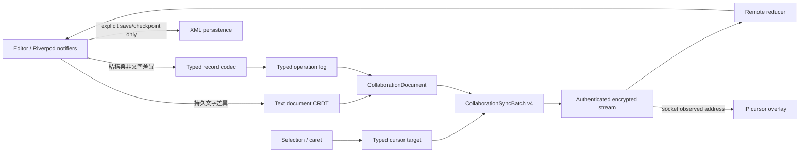

# 真即時協作系統設計

## 目標與不可破壞的邊界

這次重構把「專案檔同步」與「即時協作」拆成兩條完全不同的資料路徑：

- 章節正文，以及大綱、角色、世界設定中具穩定 owner id 的持久文字欄位，使用 sequence CRDT；同時輸入、亂序抵達與重送都必須收斂。
- `ProjectData` 其餘資料使用封閉型別的 operation log，不傳未驗證的任意 patch。
- 章節與 CRDT ProjectData 文字游標使用 CRDT anchor；非 CRDT 表單仍使用穩定 field id 與 selection offset。畫面標籤顯示 transport 實際觀察到的 IPv4 位址。
- 即時封包只包含 operation、ACK 與 presence，禁止包含 XML、完整 `ProjectData` 或檔案路徑；未儲存專案的初始狀態同樣拆成 CRDT 與 typed operations。
- 專案只要存在於記憶體並具有有效 UUID 就能加入即時協作；首次儲存只綁定持久化位置，不更換協作 UUID 或中斷 session。
- XML 只負責開啟、另存、歷史 checkpoint 與災難復原；一般編輯不再觸發 XML 序列化或 snapshot 傳送。
- 即時協作 wire schema 與 XML format version 各自演進，不能互相綁定。

## 資料流

### 章節與 ProjectData 持久文字

`CollaborativeText` 採 RGA 類型的 sequence CRDT：

- checkpoint 文字用 `documentId + index` 產生固定 atom id，因此兩端由同一份 XML 開啟時會得到相同基線。
- 若接收端沒有專案，來源端會把目前 materialized 文字重新表達為可 replay 的 insert operations，並把所有結構表達為 typed record operations；空白端由 operation channel 直接重建記憶體專案，不下載 XML。
- 新字元以 Unicode grapheme cluster 為 atom，emoji、組合字與代理對不會被拆壞。
- insert 記錄 parent atom；同一位置的 concurrent insert 以 atom id 全序決定結果。
- delete 只留下 tombstone，不立即移除 atom。
- parent 尚未抵達的 insert 先進 pending queue；依賴抵達後再套用。
- operation id 為 `replicaId + monotonically increasing sequence`，重送相同 operation 不會重複套用。
- 游標保存的是相鄰 atom anchor，不是脆弱的純字元 offset。遠端套用插入或刪除後，遠端 indicator 與本機 `TextEditingController.selection` 都由 anchor 重新解析，不能沿用舊數字 offset。

每個章節 UUID 本身就是一個 document id。ProjectData 文字使用 `projectText:<kind>:<ownerId>:<field>` 的穩定 document id。目前涵蓋：

- 大綱故事線、事件、場景的名稱、類型、時間、地點、聚焦點、衝突點與備註。
- 角色的所有持久 controller 欄位、核心 profile scalar 與 custom-field value；角色表格列因舊模型缺少列 id，仍由 typed record 管理。
- 世界節點的名稱、類型、備註，以及具有穩定 `LocationCustomize.id` 的自訂 key/value。

這個模型允許同一文字欄位兩端離線輸入、亂序送達、重複送達，最後仍得到相同文字。

### ProjectData typed operation log

非正文資料被拆成以下封閉 record kind：

- `baseInfo`
- `chapterFolder`、`chapterMetadata`
- `outlineStoryline`、`outlineEvent`、`outlineScene`
- `foreshadow`、`updatePlan`
- `worldNode`
- `character`、`characterState`、`characterStateBaseline`、`characterStateChange`
- `timelineGrid`、`timelineTrack`、`timelinePlacement`
- `outlineChapterLink`

每筆 `ProjectRecordOperation` 都有 record kind、穩定 record id、`put/remove/move` mutation、parent/order 關係、record schema version 與經 codec 驗證的 fields。reducer 以 `(kind, recordId)` 為 key，Lamport sequence 優先、operation id 作 deterministic tie-break，並保留 remove tombstone。

目前 UI 聚合狀態改變後會建立 record snapshot map，僅對改變的 record 產生 operation。章節 `chapterContent` 與上述 CRDT ProjectData 文字會從 collaboration record snapshot 遮罩為空值，只保留 stable id、父子關係、順序、enum、數字與集合結構；因此文字輸入不會同時產生 LWW record 來覆蓋 CRDT 合併結果。遠端 operation 只重建受影響的資料區，再以 CRDT materialized text overlay 後呼叫對應 notifier。

## Wire protocol v4

`CollaborationSyncBatch` 只允許下列欄位：

- `schemaVersion`
- `projectUuid`
- `senderReplicaId`
- `acknowledgedSequences`
- `operations`
- `presence`

所有 JSON object 都做 exact-key 與型別驗證。batch 上限為 128 operations；目前 coordinator 每次最多選 32 筆，並把編碼後 batch 限制在 30 KiB。單次 CRDT insert payload 的協定硬上限為 24 KiB；本機編輯與 operation-backed baseline 會預先切成約 4 KiB 的 grapheme-safe chunks，替 JSON escaping 保留空間。v4 不再逐 atom 重複傳完整 JSON id：insert wire payload 只傳首個 parent anchor 與 grapheme text，atom id 由 operation id 和 index 還原；delete 把連續 atom id 壓成 span。這讓數萬字的未儲存章節可用少量 bounded operations 建立基線。若一筆 typed record 自身超過 30 KiB，現在會明確報錯，後續必須再拆成 field-level records，不能退回整份 XML。

ACK 是每個 replica 已連續收到的最高 sequence。中間有缺號時保留 gap，ACK 不會越過缺口；sender 依對方 ACK 重送尚未確認的 operation。這讓 TCP 重連、短連線 fallback 和重複封包共用同一套正確性模型。

## 傳輸與 presence

- 桌面 Dart I/O 使用已配對 session 的 authenticated encrypted TCP 長連線。
- 握手交換初始 batch，之後使用 `collaborationBatchPush` 雙向推送；更新本地 batch 時立即送到活動連線。
- coordinator 每 80 ms 檢查狀態，閒置時每 750 ms 送 presence/ACK heartbeat；5 秒未更新的遠端游標會消失。
- 長連線斷掉後回到重新握手；operation log 與 ACK 負責補送，不用 XML 補差異。
- Android 現有 MethodChannel 只能持有 request/response socket，暫時使用相同加密 batch 的短連線 fallback。它不是最終的低延遲方案；完成 native stream bridge 後才能與桌面端等價。

presence 內仍帶 `replicaId` 做內部去重，但顯示名稱依需求使用 IP。接收端一律用 socket 的 observed IP 覆蓋封包自稱的 IP，避免偽造標籤。IP 不是安全身分：同一台 NAT、同一裝置的多個視窗或位址切換都可能重複，因此授權仍由已配對裝置金鑰與 session 決定。

presence target 是封閉型別：`chapterText` 帶 chapter id 與 CRDT anchor/focus；`projectText` 帶 ProjectData text document id 與 CRDT anchor/focus；`projectField` 帶非 CRDT 表單的穩定 field id 與 selection offsets。UI label 不可拿來當 field id。基本資訊仍使用 `projectField`；大綱、角色、世界設定改用 `projectText`。章節選擇清單會依 chapter id 顯示正在編輯其他章節的協作者 IP。

## XML 的新角色

XML 只在下列情境出現：

1. 開啟既有 `.mnproj`，建立 CRDT/typed-record checkpoint。
2. 使用者明確儲存或另存，將目前 materialized state 寫回 XML。
3. 歷史 checkpoint、匯出與災難復原。

舊 revision/snapshot 子系統可暫時保留作 checkpoint/bootstrap，但不再由每次狀態變更觸發，也不屬於 collaboration batch。完成 operation-log 耐久化後，live session 應完全不需要下載 XML snapshot。

新專案與空白接收端不依賴這條 XML 路徑：協商時會廣播記憶體專案 UUID，安全通道建立後以 operation-backed baseline 初始化空白端。首次按下儲存或另存時保留同一 UUID，只新增 `.mnproj` 位置。

## 已完成的重構

- 移除 `main.dart` 中每次編輯 debounce 後序列化整份 XML、建立 P2P draft snapshot 的流程。
- 新增純 Dart 通用文字 CRDT、typed operation、ACK/replay document 與嚴格 wire schema v4。
- 未儲存或仍有修改的記憶體專案可直接成為 project offer；沒有本機專案的 peer 會先建立同 UUID 的記憶體工作副本，再由 CRDT/typed operations 初始化。
- 新增完整 `ProjectData` record codec；正文不進 record operation。
- 新增 collaboration Riverpod coordinator，將本地 editor/provider 變化轉成 operation，並把遠端 operation 套回目標 notifier。
- 新增桌面 encrypted long-lived push 與 Android bounded-batch fallback。
- chapter editor 與 ProjectData 表單共用 overlay，直接從 `RenderEditable` caret rect 畫出遠端游標；IP label 獨立定位，不會因字級或 label 高度推移 caret。
- 大綱、角色與世界設定的穩定持久文字已改為 CRDT document；章節選擇清單可標示不同章節的遠端 IP presence。
- snapshot overwrite 不再被當成 live merge；有未儲存內容時拒絕遠端整份覆寫。

## 後續遷移順序

### P0：可恢復的本機 operation journal

目前尚未 ACK 的 operation 仍在記憶體。下一步要用 append-only journal 寫入 app-private storage，包含 operation、contiguous ACK vector 與 checkpoint id；重啟後先載入 XML checkpoint，再 replay journal。每筆需 length-prefix、checksum 與原子 fsync/rename，截斷尾端不能破壞前面有效資料。

### P0：checkpoint compaction 與 tombstone GC

當所有已知 replica 都 ACK 某個 frontier 後，可輸出新的 XML checkpoint與 CRDT seed metadata，再移除 frontier 之前的 operation/tombstone。若有長期離線 replica，必須由 retention policy 將它撤銷，不能直接猜測已收到。

### P1：Android native stream bridge

原生層要提供可持續讀寫的 Wi-Fi-bound socket stream、disconnect callback 與 backpressure；Dart 層沿用相同 frame/schema，不另造 Android 協定。

### P1：多 peer session

目前 UI coordinator 仍以單一 `reachablePeer` 為主。多協作者需要每 peer ACK vector、每 peer connection 狀態、慢 peer queue 上限與 hub/mesh 選擇；operation/CRDT 本身不需改版。

### P1：大 record 細分

大型 character/world 的非 CRDT 結構與缺少 stable id 的角色表格列仍要拆為 list-item record，確保任何單一 operation 都小於 30 KiB。schema migration 必須提供舊版 decoder 或明確拒絕，禁止 silently drop fields。

### P2：可觀測性與故障注入

加入 pending operation 數、ACK lag、reconnect 次數、batch bytes、invalid frame 次數；以測試代理注入 reorder、duplicate、drop、disconnect 與延遲，驗證最終收斂和記憶體上限。

## 驗收條件

- 兩端同時在同一位置插入文字，任意順序送達後內容一致。
- delete 與 concurrent insert、emoji/grapheme、duplicate/out-of-order operation 都收斂。
- 只修改章節正文、大綱描寫、角色持久文字或世界設定持久文字時，typed `ProjectData` diff 為空。
- 修改任一非正文 record 時，只產生對應 kind/id 的 operation。
- 即時封包序列化結果不含 `xmlContent`、完整 XML 或本機檔案路徑。
- 新專案未選擇檔案路徑時即可建立安全 session，空白 peer 最終重建相同章節、ProjectData 文字與 typed records；首次儲存後 project UUID 不變。
- 長連線能雙向主動推送；斷線重連後依 ACK 補齊。
- 游標標籤顯示 socket-observed IPv4，偽造的 payload IP 不會出現在 UI。
- 協作者停留在不同章節時，章節選擇清單在對應章節顯示 IP 標示與可存取語意。
- 關閉 provider、解除配對或 dispose endpoint 後，timer、subscription、socket 和加密 session 都確實釋放。

## 程式碼位置

- `lib/domain/collaboration/`：CRDT、typed operation log、ACK/replay 與 wire model。
- `lib/application/collaboration/project_record_codec.dart`：`ProjectData` 與 typed records 的邊界。
- `lib/application/collaboration/project_collaborative_text_codec.dart`：穩定 ProjectData text document id 與 model projection。
- `lib/presentation/providers/collaboration_providers.dart`：Riverpod coordinator。
- `lib/data/p2p/p2p_endpoint_service.dart`：認證、加密、長連線與 fallback transport。
- `lib/presentation/widgets/remote_text_cursor_overlay.dart`：共用遠端 CRDT cursor overlay 與章節 presence badge。
- `lib/main.dart`：editor/provider 接線與 XML persistence boundary。
